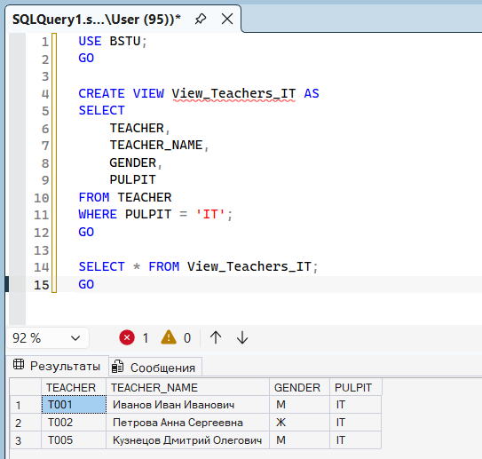
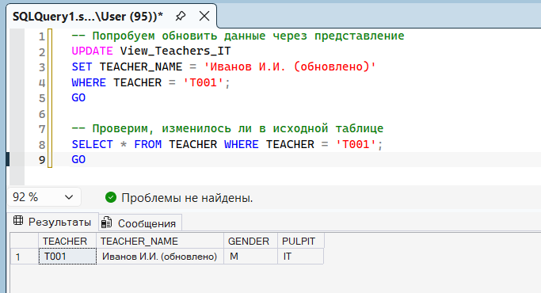
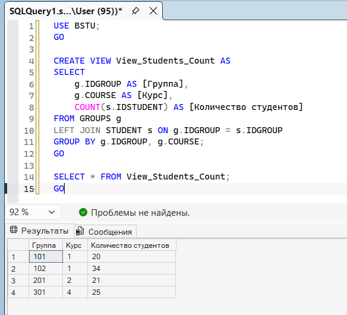
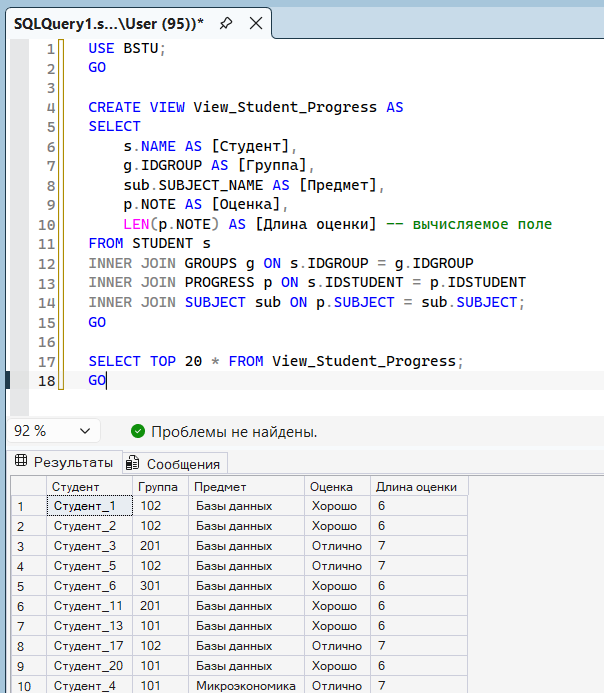

# Три представления по БД BSTU

## Представление 1. МОДИФИЦИРУЕМОЕ

## Проверка модифицируемости

## Представление 2. НЕ модифицируемое (с GROUP BY)

Почему не модифицируемое: Содержит GROUP BY и COUNT() - нарушает 2 критерия сразу

## Представление 3. НЕ модифицируемое (с JOIN и вычисляемым полем)

**Почему не модифицируемое:**

- Использует JOIN (несколько таблиц).

- Содержит вычисляемое поле LEN(p.NOTE).

