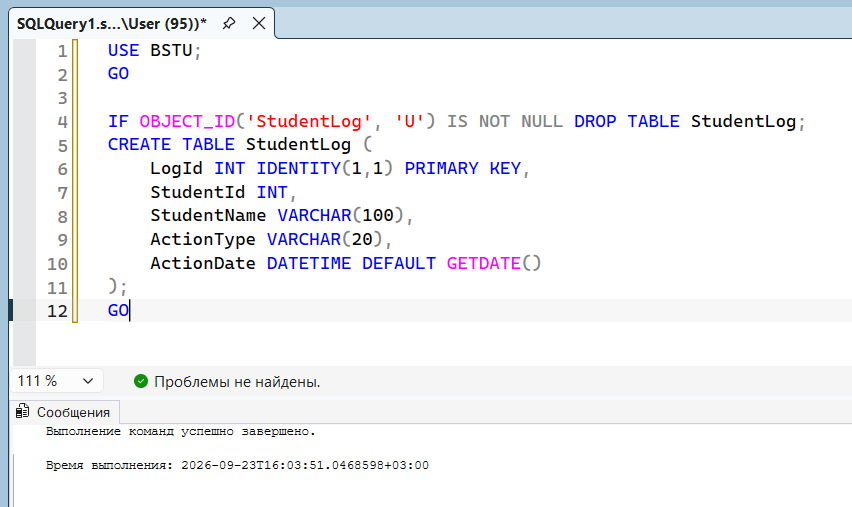
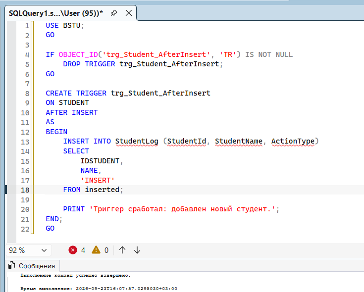
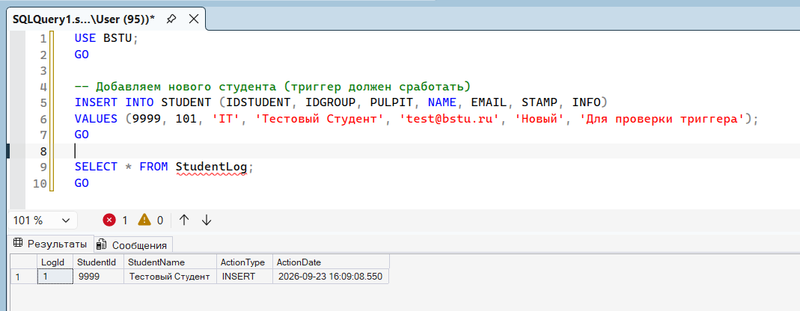
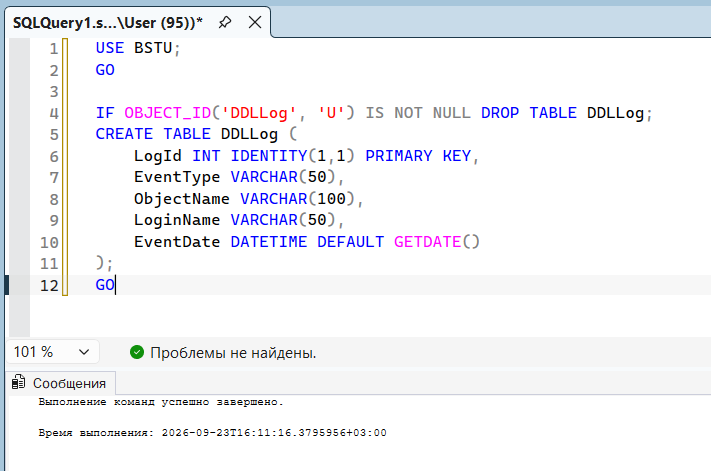
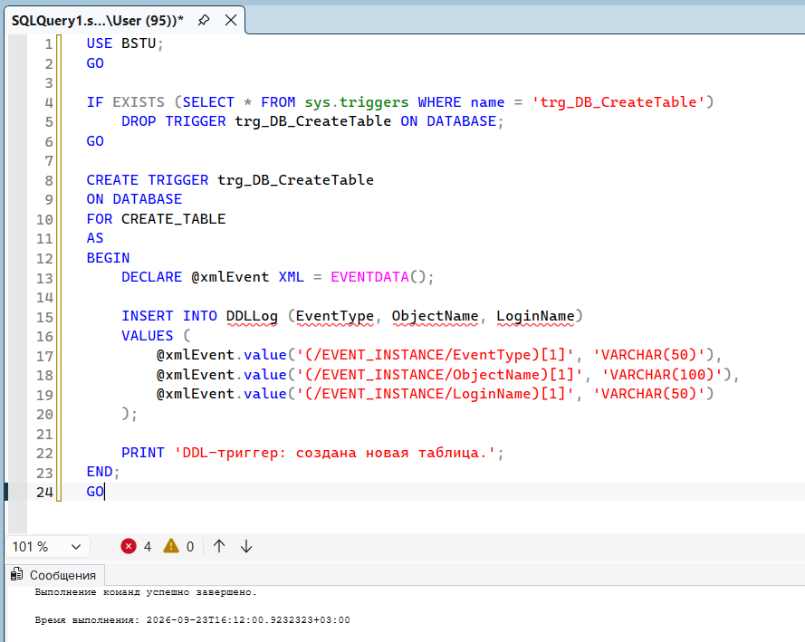
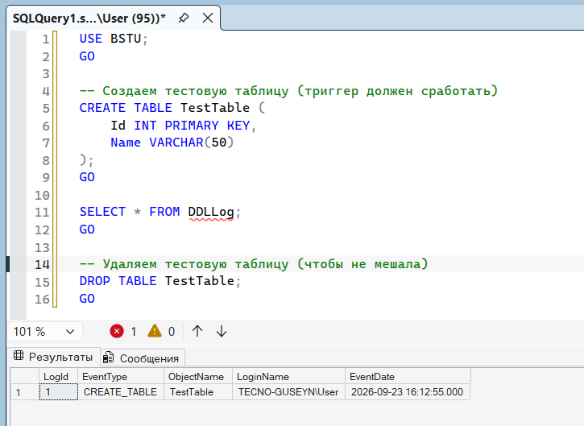
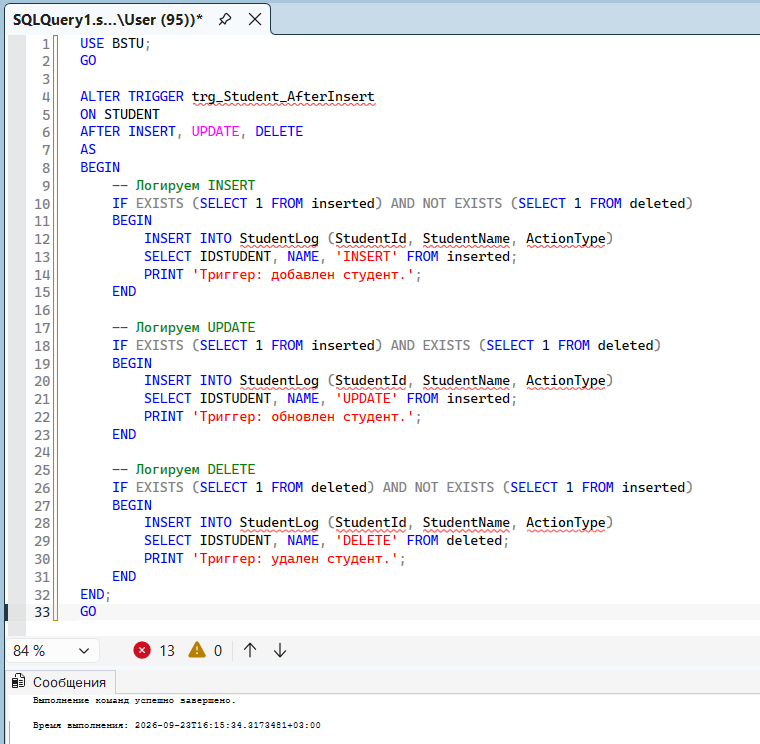
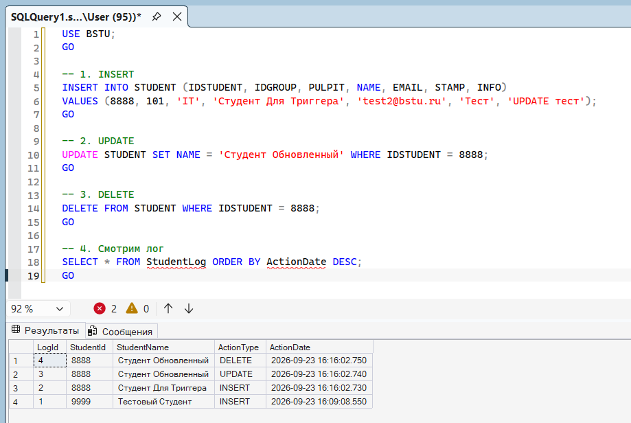
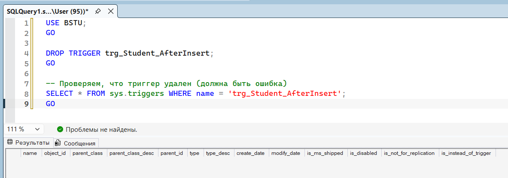
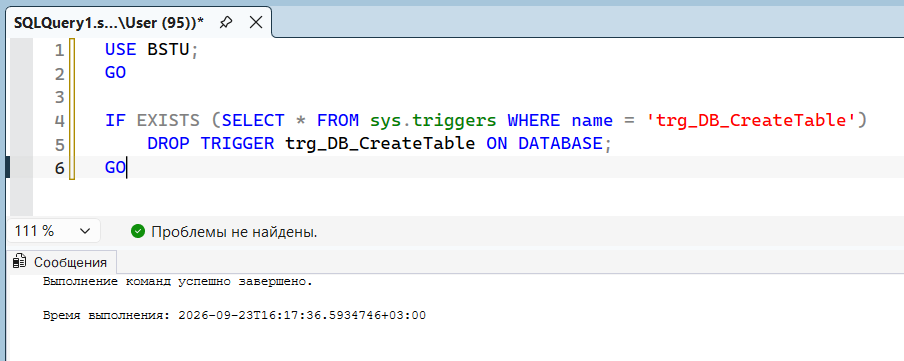

# Триггеры в MS SQL Server

## Триггер 1. DML-триггер на таблицу STUDENT (AFTER INSERT)

## Создаем таблицу для логов

## Создаем DML-триггер

## Проверяем работу триггера

## Триггер 2. DDL-триггер на базу данных (CREATE_TABLE)

## Создаем таблицу для DDL-логов

## Создаем DDL-триггер на базу

## Проверяем работу DDL-триггера

## Изменяем DML-триггер (ALTER TRIGGER)

## Проверяем обновленный триггер

## Удаляем DML-триггер (DROP TRIGGER)

## Удаляем DDL-триггер

