# Транзакции и блокировки в T-SQL

## Слайд 16. BEGIN TRANSACTION + COMMIT

Что это: Транзакция - это группа команд, которые выполняются как единое целое. COMMIT — подтверждает изменения.

Зачем: Чтобы если на середине что-то упадет, база не осталась в «полусломанном» состоянии.

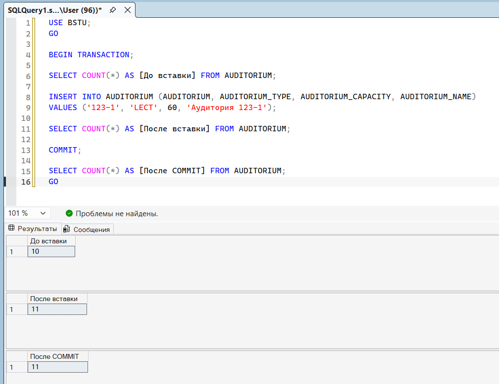

## Слайд 17. ROLLBACK

Что это: ROLLBACK — откат транзакции. Все изменения внутри неё отменяются, как будто их не было.

Зачем: Если в середине транзакции произошла ошибка — можно всё отменить.

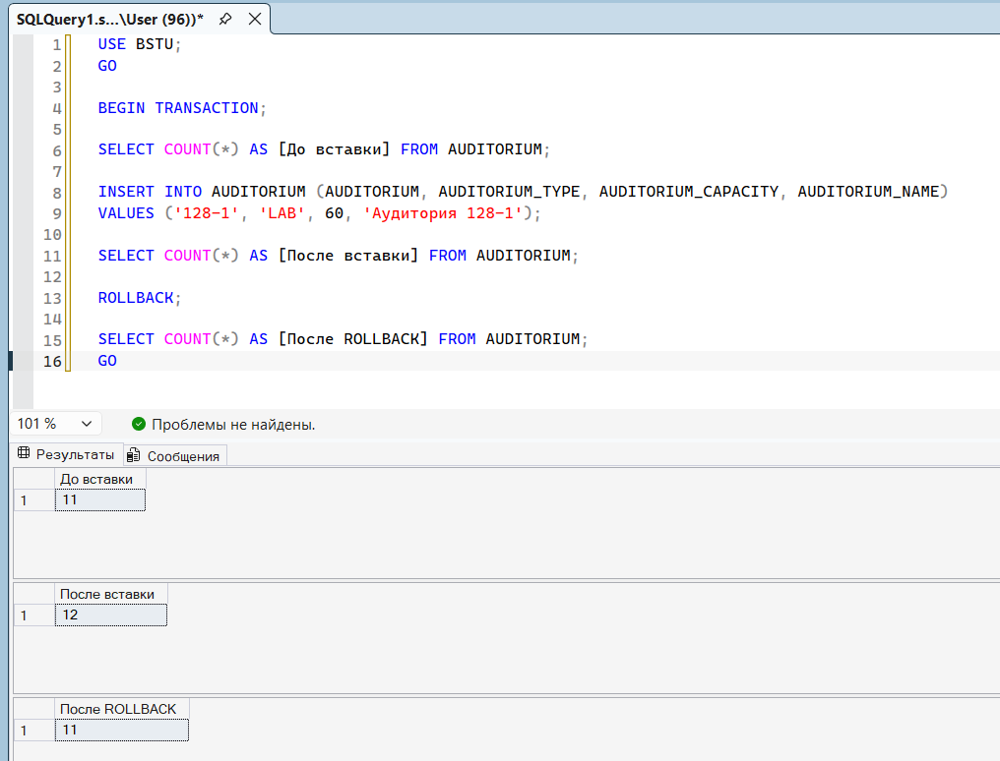

## Слайды 18-19. SAVE TRANSACTION (точки сохранения)

Что это: Позволяет откатить часть транзакции, а не всю. Создаётся метка, к которой можно вернуться через ROLLBACK TRANSACTION метка.

Зачем: Если в длинной транзакции одна операция неудачная — можно откатить только её, а не всё.

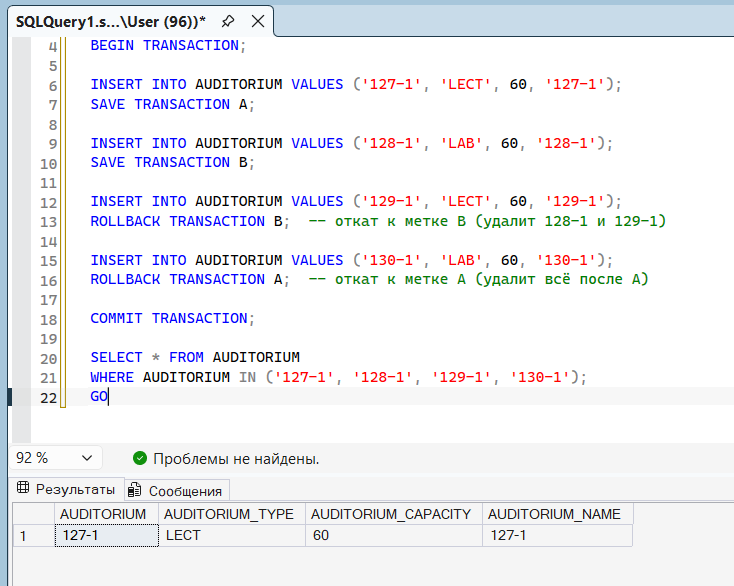

## Слайды 22-23. @@TRANCOUNT (вложенные транзакции)

Что это: @@TRANCOUNT — системная переменная, которая показывает уровень вложенности транзакций. BEGIN увеличивает на 1, COMMIT уменьшает на 1.

Зачем: Понять, сколько транзакций сейчас активно. Используется в хранимых процедурах.

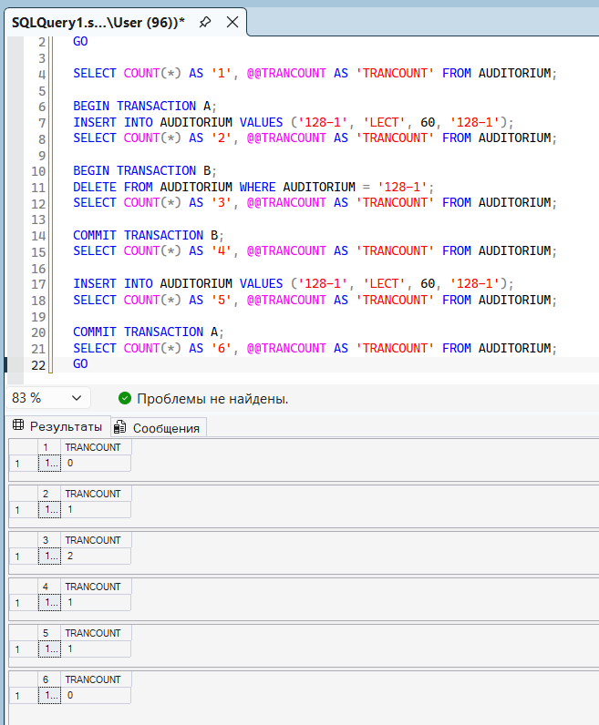

## Слайд 33. Блокировки (sys.dm_tran_locks)

Что это: Системное представление, которое показывает активные блокировки в базе данных.

Зачем: Понять, кто и что блокируетСлф

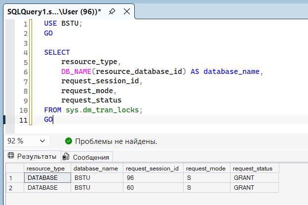

## Слайд 34-35. Взаимоблокировки (Deadlock)

Что это: Две транзакции блокируют друг друга. Каждая ждёт, пока другая освободит ресурс. SQL Server сам выбирает «жертву» и откатывает её.

Зачем: Понимать, почему иногда транзакции падают с ошибкой 1205.

- Пытались воспроизвести ситуацию взаимоблокировки - когда две параллельные транзакции блокируют ресурсы друг друга, не выдала ошибка.

**Окно 1:**

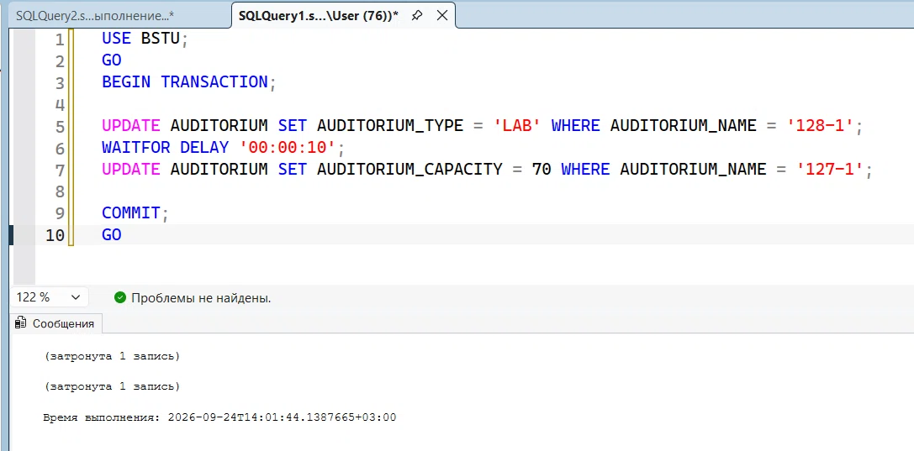

**Окно 2:**

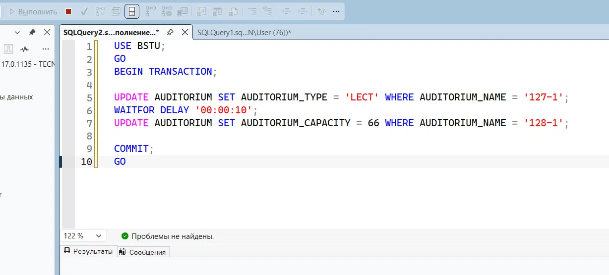

## Слайды 45-46. READ UNCOMMITTED (грязное чтение)

Что это: Самый низкий уровень изоляции. Транзакция видит незакоммиченные изменения других транзакций.

Зачем: Показать проблему «грязного чтения».

**Ход выполнения:**

- Окно А (READ UNCOMMITTED) открыло транзакцию и увидело 13 аудиторий.

- Окно Б открыло параллельную транзакцию и удалило строку 128-1, но не закоммитило. Количество стало 12.

- Окно А повторно прочитало данные и увидело 12 — хотя удаление ещё не подтверждено. Это и есть грязное чтение.

- Окно Б откатило транзакцию — количество вернулось к 13.

- Окно А после отката увидело 13.

## Окно А — читаем данные

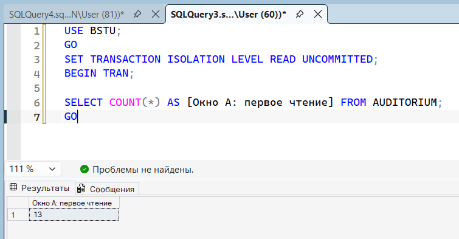

## Окно Б — удаляем строку, но не коммитим

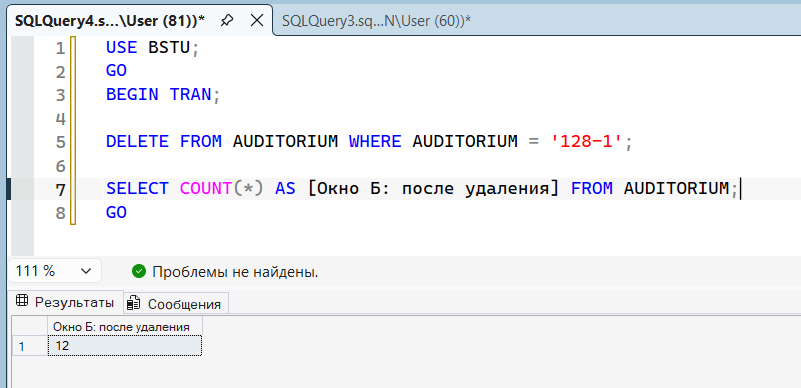

## Окно А — читаем снова

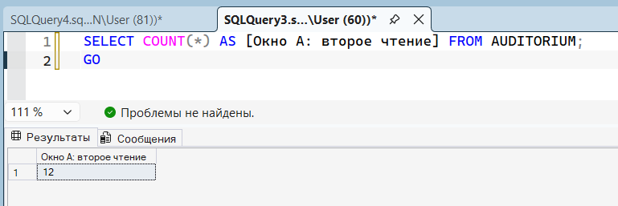

## Окно Б — откатываем транзакцию

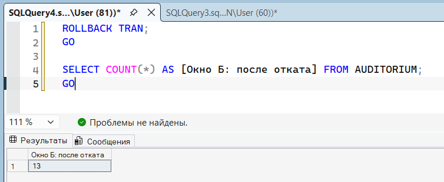

## Окно А — проверяем, что данные «вернулись»

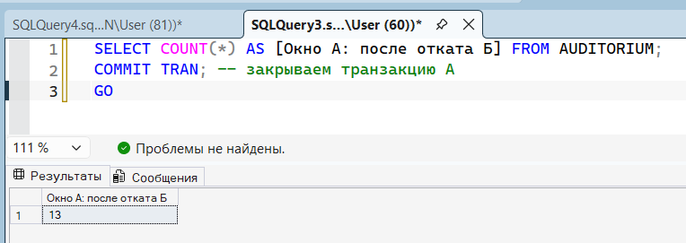

Вывод: Уровень READ UNCOMMITTED допускает чтение незакоммиченных данных, что может привести к работе с информацией, которая в итоге не будет сохранена в базе.

## Слайды 47-49. READ COMMITTED

## ТЕСТ 1 (Слайд 48). READ COMMITTED НЕ допускает грязного чтения

Идея: Окно А читает данные. Окно Б делает DELETE, но не коммитит. Окно А пытается прочитать снова — и зависает в ожидании (потому что строка заблокирована транзакцией Б).

**Окно А:**

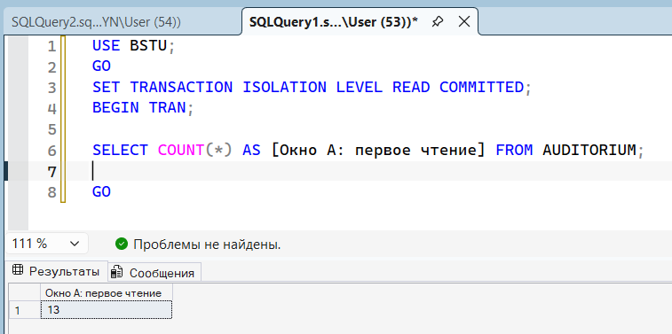

**Окно Б:**

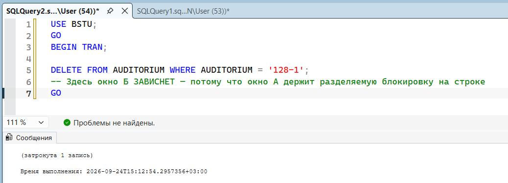

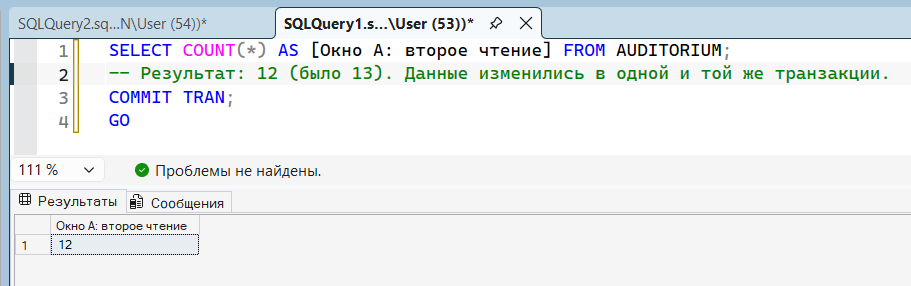

Окно А: первое чтение — 13.Окно Б: DELETE прошёл без ожидания («затронута 1 запись»).

Вывод: READ COMMITTED снимает разделяемую блокировку сразу после выполнения SELECT, поэтому параллельная транзакция может изменить данные. Блокировка не удерживается до конца транзакции (в отличие от REPEATABLE READ).

## Слайд 49. READ COMMITTED — Тест 2 (неповторяющееся чтение)

Цель теста: показать, что при уровне изоляции READ COMMITTED один и тот же запрос внутри одной транзакции может давать разные результаты, если параллельная транзакция закоммитила изменения между двумя чтениями.

**Ход выполнения:**

- Окно А: SET TRANSACTION ISOLATION LEVEL READ COMMITTED → BEGIN TRAN → первое чтение COUNT(*) = 13.

- Окно Б: BEGIN TRAN → DELETE строки 128-1 → COMMIT TRAN (изменение зафиксировано).

- Окно А: повторное чтение COUNT(*) в той же транзакции = 12.

- Окно А: COMMIT TRAN.

**Окно А:**

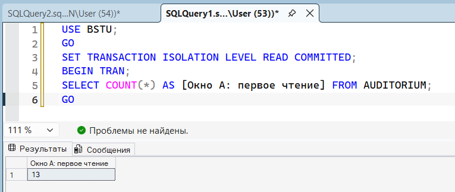

**Окно Б:**

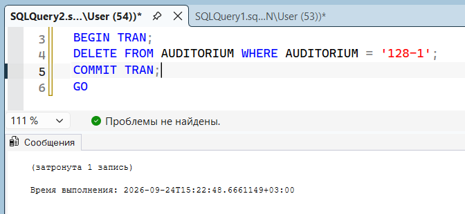

**Окно А:**

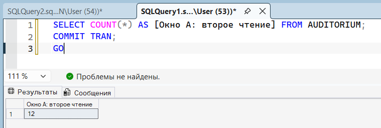

Результат: в рамках одной транзакции А получены два разных значения — 13 и 12.

Вывод: READ COMMITTED не допускает грязного чтения (данные Б были закоммичены), но допускает неповторяющееся чтение — повторный SELECT вернул другое количество строк, потому что параллельная транзакция успела закоммитить изменение между чтениями.

## Слайды 50-52. REPEATABLE READ

## ТЕСТ 1 (Слайд 51). REPEATABLE READ НЕ допускает неповторяющегося чтения

Идея: Окно А читает данные и держит блокировку до конца транзакции. Окно Б пытается удалить строку — зависает в ожидании. Только после COMMIT в Окне А удаление пройдёт.

## Подготовка отсутствия активных транзакций (окно А и Б)

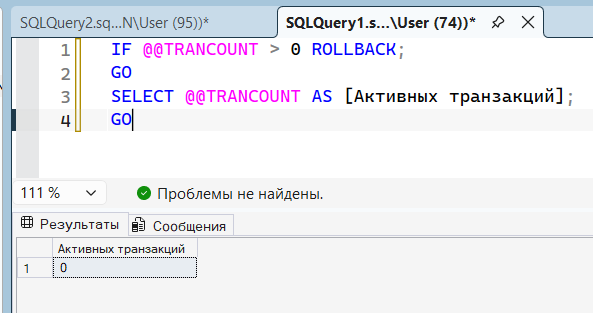

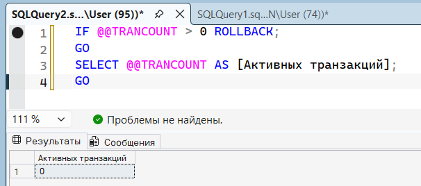

## Окно А — открываем транзакцию и читаем

- открыта транзакция REPEATABLE READ, первое чтение = 13

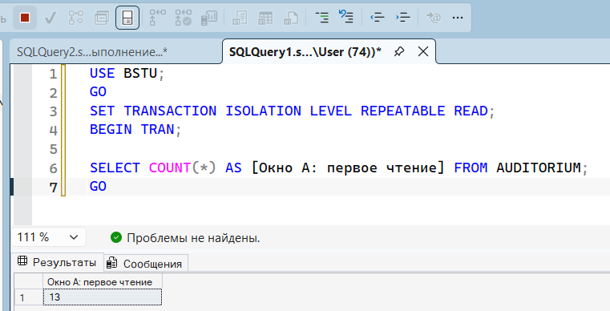

## Окно Б — DELETE завис в ожидании

- DELETE строки 128-1 завис в ожидании — REPEATABLE READ удерживает S-блокировку до конца транзакции

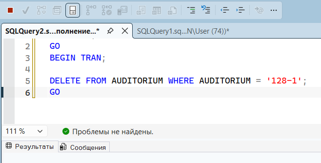

## Окно А — завершаем транзакцию

Окно А: COMMIT TRAN — блокировка снята.

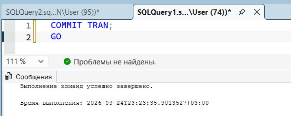

## Окно Б — DELETE выполнился

осле снятия блокировки DELETE мгновенно выполнился («затронута 1 запись»).

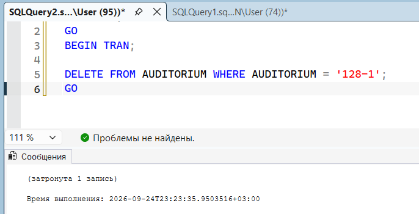

## ТЕСТ 2 (Слайд 52). REPEATABLE READ допускает фантомное чтение

Идея: REPEATABLE READ блокирует изменение/удаление прочитанных строк, но не блокирует вставку новых. Окно А дважды прочитает данные и увидит новую строку, которой не было при первом чтении.

## Окно А — открываем транзакцию, читаем

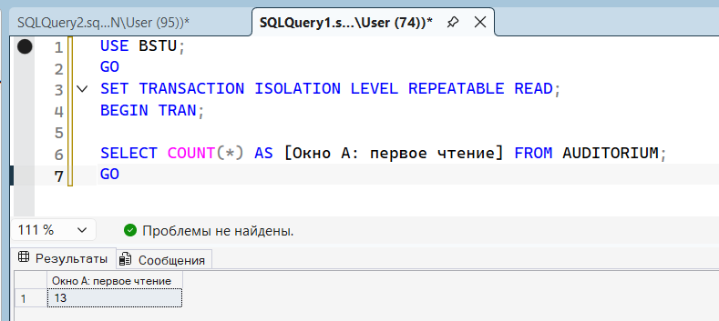

## Окно Б — вставляем новую строку

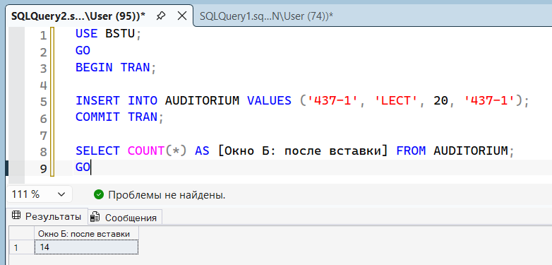

## Окно А — читаем снова

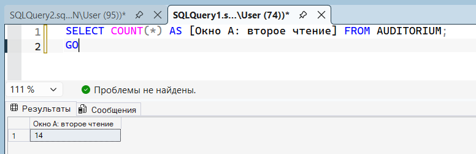

## Закрываем транзакцию А

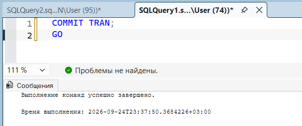

Результат: в рамках одной транзакции А количество строк изменилось с 13 на 14.

Вывод: REPEATABLE READ НЕ защищает от фантомного чтения - новая строка, вставленная параллельной транзакцией, появилась в результатах повторного чтения внутри одной транзакции. В отличие от SERIALIZABLE, где вставка была бы заблокирована.

## Слайд 55. SERIALIZABLE

**Что демонстрируем:**

SERIALIZABLE — самый строгий уровень. Он блокирует не только строки, но и диапазон ключей. Это значит, что другая транзакция не может ни изменить, ни вставить новые строки в прочитанный диапазон, пока первая не закоммитится.

**Главное отличие от REPEATABLE READ:**

- REPEATABLE READ → блокирует только прочитанные строки (вставлять можно).

- SERIALIZABLE → блокирует весь диапазон (вставлять нельзя).

**Текущее состояние таблицы:**

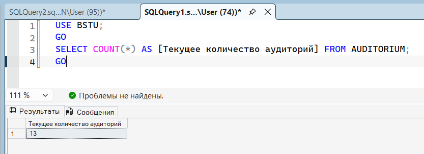

## Окно А — открываем SERIALIZABLE транзакцию

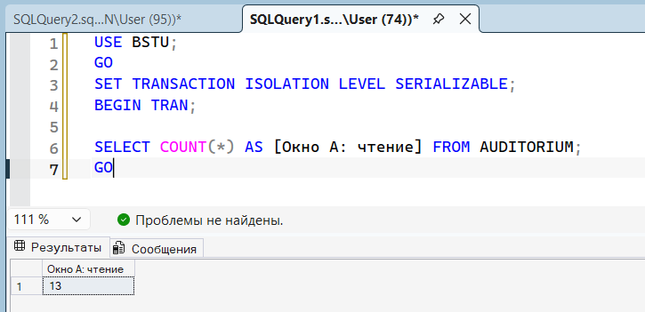

## Окно Б — пытаемся вставить новую строку

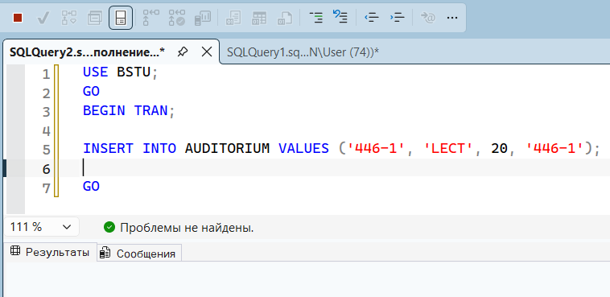

## Окно А — завершаем транзакцию

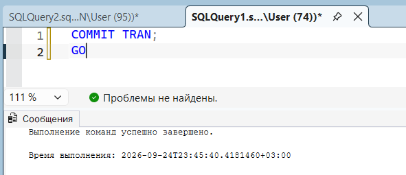

## Окно Б — вставка завершилась

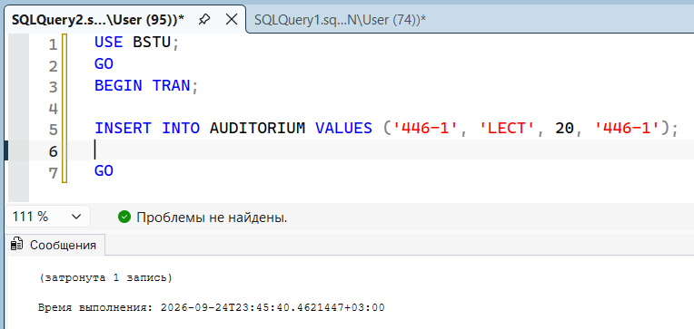

## Проверяем результат

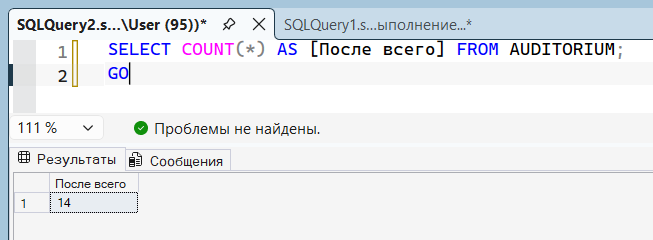

- Число увеличилось на 1 (стало 14)

Вывод: SERIALIZABLE предотвращает фантомное чтение — вставка новой строки в прочитанный диапазон блокируется до конца транзакции первой сессии. Это самый строгий уровень изоляции, который решает все проблемы параллельного доступа, но ценой производительности.

## Слайд 57. DBCC USEROPTIONS

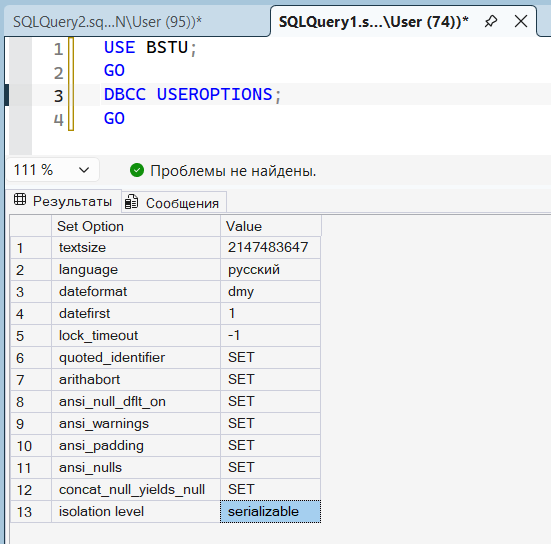

Команда показывает текущие настройки сессии. В данном случае isolation level = serializable, потому что в этой сессии ранее был установлен уровень SERIALIZABLE. По умолчанию в SQL Server используется READ COMMITTED.

## Слайды 64-65. SNAPSHOT

**Что демонстрируем:**

SNAPSHOT-транзакция видит данные на момент своего начала. Другая транзакция может вставлять/изменять данные — первая этого не увидит, пока не закоммитится.

## Включаем SNAPSHOT для базы

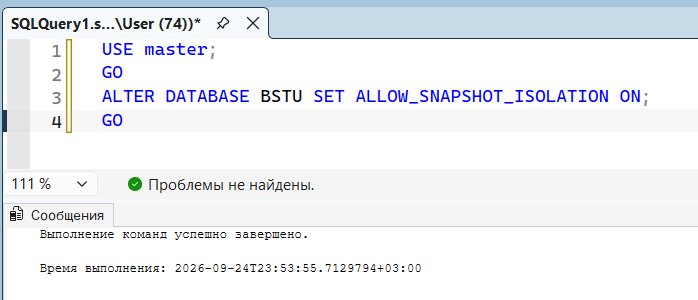

## Подготовка

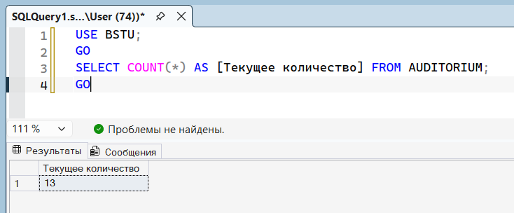

## Окно А — открываем SNAPSHOT-транзакцию

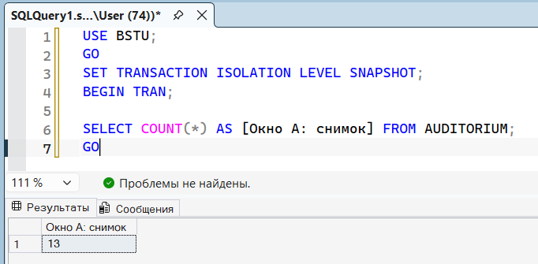

## Окно Б — вставляем строку и коммитим

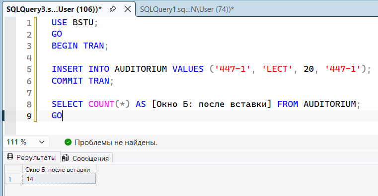

## Окно А — читаем снова

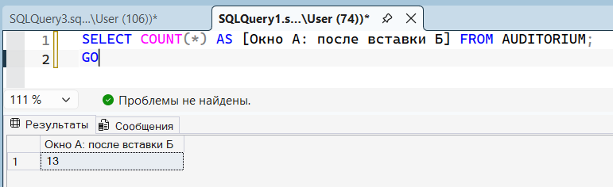

## Окно А — COMMIT и проверка

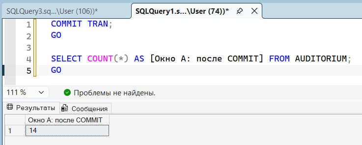

Результат: в SNAPSHOT-транзакции данные не меняются до её завершения.

Изменения других транзакций становятся видны только после COMMIT.

Вывод: SNAPSHOT решает проблемы неповторяющегося и фантомного чтения без блокировок, но использует tempdb для хранения версий строк.

