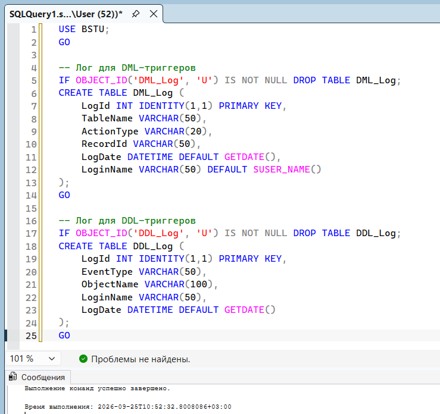
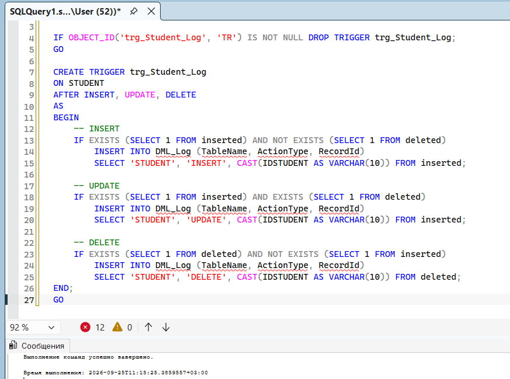
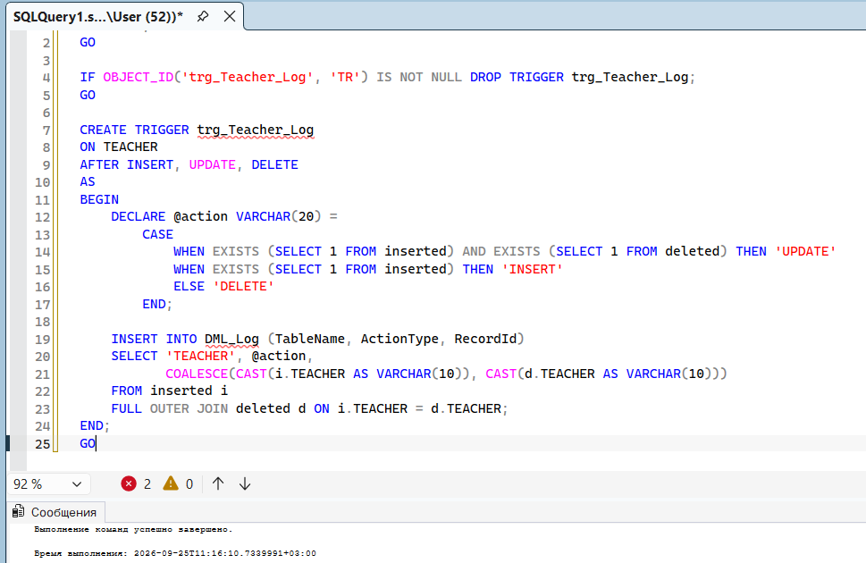
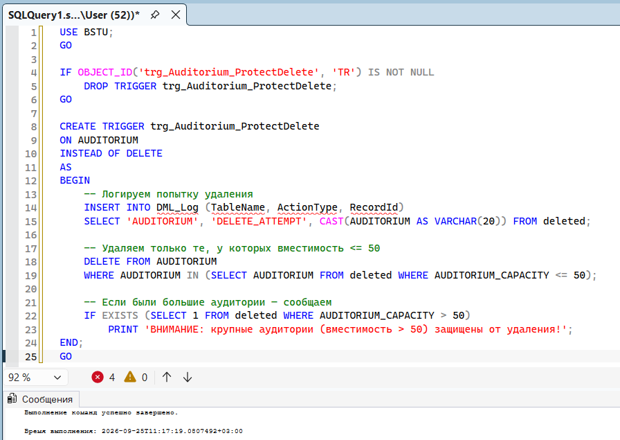
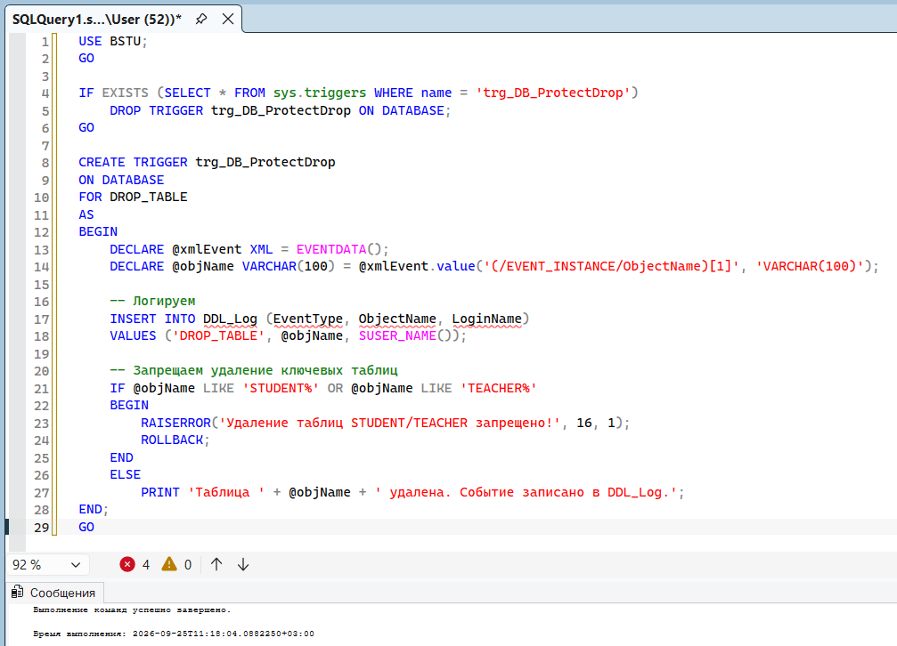
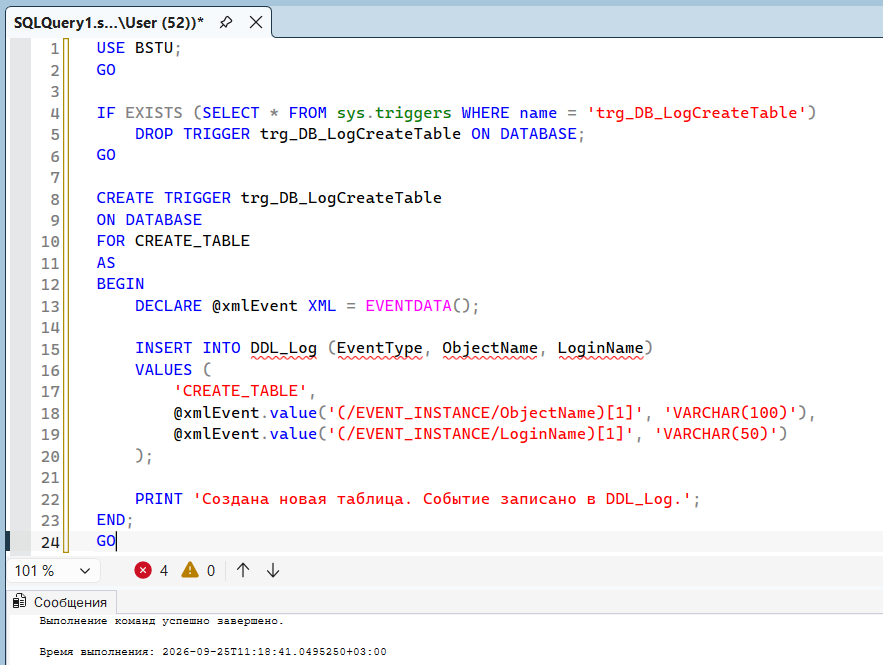
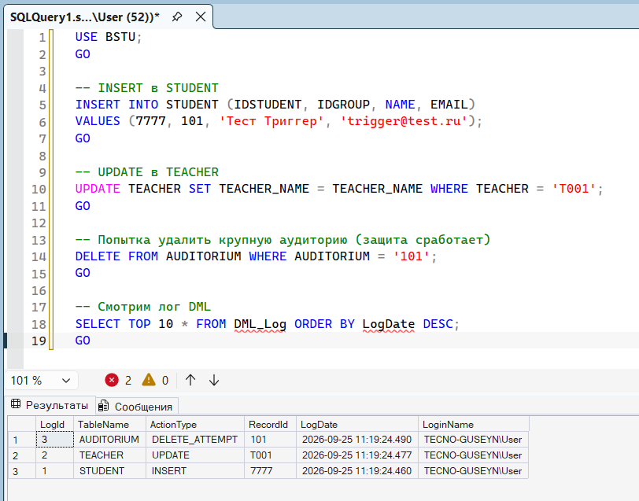
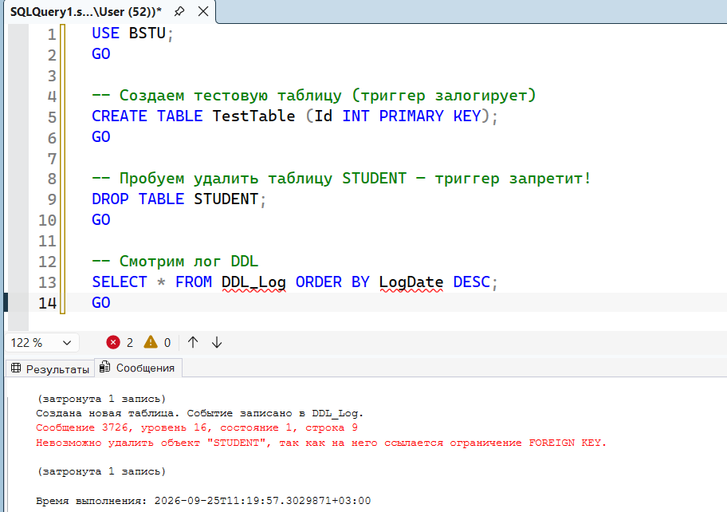

# Триггеры в MS SQL Server

## Подготовка (таблицы для логов)

## Триггер 1. DML на таблицу STUDENT (AFTER INSERT, UPDATE, DELETE)

Что делает: логирует любые изменения в таблице студентов.

## Триггер 2. DML на таблицу TEACHER (AFTER INSERT, UPDATE, DELETE)

Что делает: логирует изменения в таблице преподавателей.

## Триггер 3. DML на таблицу AUDITORIUM (INSTEAD OF DELETE — защита)

Что делает: запрещает удаление аудиторий, если их вместимость > 50 (защита крупных аудиторий)

## Триггер 4. DDL на базу — запрет удаления таблиц (CREATE_TABLE / DROP_TABLE)

Что делает: запрещает удаление таблиц, начинающихся с STUDENT или TEACHER (защита ключевых таблиц)

## Триггер 5. DDL на базу — аудит создания таблиц (CREATE_TABLE)

Что делает: логирует все создания новых таблиц.

## Проверка всех триггеров

Проверка DML (вставка/обновление/удаление):

**Проверка DDL (создание/удаление таблиц):**

