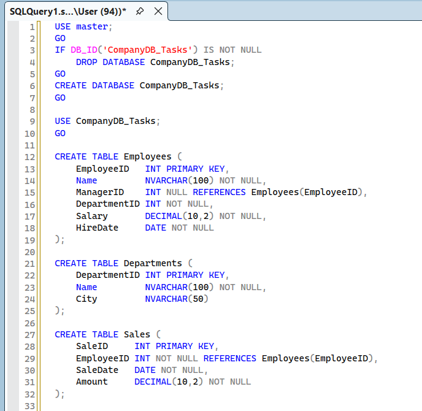
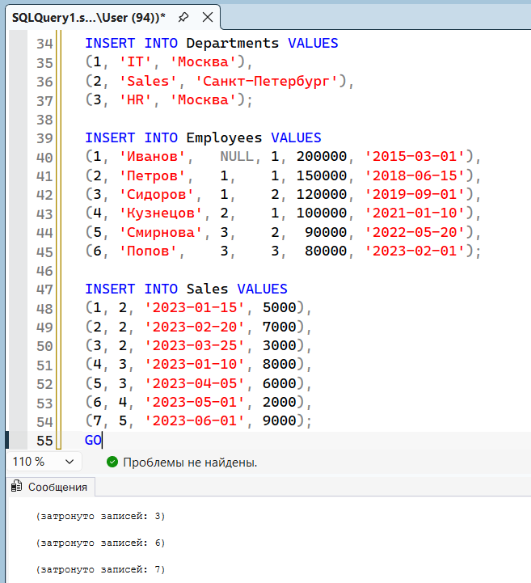
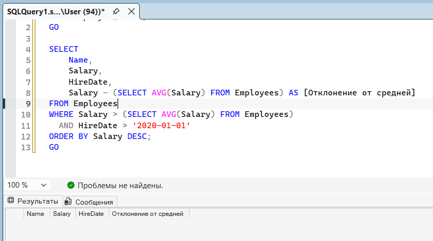
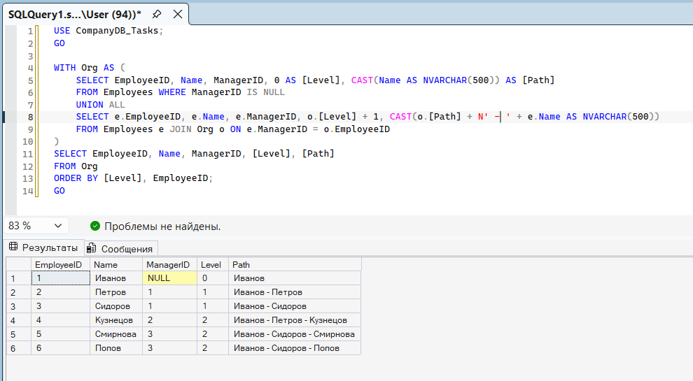
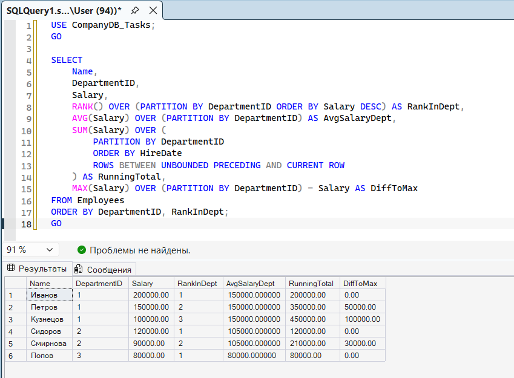
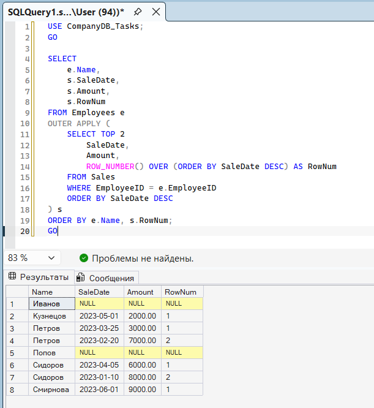

Самостоятельная работа по SQL Server (T-SQL)---Часть 1. Теоретические вопросы Ответьте кратко (2–4 предложения):1. В чём разница между WHERE и HAVING?2. Чем UNION отличается от UNION ALL?3. Что такое APPLY и в чём разница между CROSS APPLY и OUTER APPLY?4. Чем отличается VIEW от хранимой процедуры? Приведите по одному примеру, когда что использовать.5. Что такое оконная функция? Чем она отличается от GROUP BY? (случайно)

1) WHERE фильтрует строки до группировки, а HAVING – уже сгруппированные данные после GROUP BY. Главное отличие в том, что WHERE нельзя использовать агрегатные функции (sum, count), а в HAVING можно.2) UNION объединяет результаты двух запросов и удаляет дубликаты, на это он тратит ресурсы (на сортировку). UNION ALL просто склеивает результаты и сохраняет все дубликаты, поэтому работает быстрее.

3) APPLY позволяет выполнить подзапрос или табличную функцию для каждой строки внешней таблицы, передавая туда ее значение. CROSS APPLY работает как INNER JOIN, то есть возвращает только строки с совпадениями, а OUTER APPLY как LEFT JOIN, возвращает все строки, подставляя null, если совпадений нет.

4) VIEW – это у  нас виртуальная таблица на основе SELECT, которая используется для упрощения сложных запросов. Хранимая процедура – это набор инструкций, который может принимать параметры, изменять данные и тд.

5) Оконная функция вычисляет агрегат по группе строк, но при этом не сворачивает исходные строки, а добавляет результат в каждую из них. GROUP BY наоборот работает, то есть сворачивает строки, оставляя только по одной строке на каждую группу---

Часть 2. Практические задания Схема базы данных

```sql
CREATE TABLE Employees (
EmployeeID   INT PRIMARY KEY,
Name         NVARCHAR(100)  NOT NULL,
ManagerID    INT NULL REFERENCES Employees(EmployeeID),
DepartmentID INT NOT NULL,
Salary       DECIMAL(10,2)  NOT NULL,
HireDate     DATE           NOT NULL
);
CREATE TABLE Departments (
DepartmentID INT PRIMARY KEY,
Name         NVARCHAR(100) NOT NULL,
City         NVARCHAR(50)
);
CREATE TABLE Sales (
SaleID     INT PRIMARY KEY,
EmployeeID INT NOT NULL REFERENCES Employees(EmployeeID),
SaleDate   DATE NOT NULL,
Amount     DECIMAL(10,2) NOT NULL
);
```

INSERT INTO Departments VALUES

(1, 'IT', 'Москва'),

(2, 'Sales', 'Санкт-Петербург'),

(3, 'HR', 'Москва');

INSERT INTO Employees VALUES

(1, 'Иванов',  NULL, 1, 200000, '2015-03-01'),

(2, 'Петров',  1,    1, 150000, '2018-06-15'),

(3, 'Сидоров', 1,    2, 120000, '2019-09-01'),

(4, 'Кузнецов',2,    1, 100000, '2021-01-10'),

(5, 'Смирнова',3,    2,  90000, '2022-05-20'),

(6, 'Попов',   3,    3,  80000, '2023-02-01');

INSERT INTO Sales VALUES

(1, 2, '2023-01-15', 5000),

(2, 2, '2023-02-20', 7000),

(3, 2, '2023-03-25', 3000),

(4, 3, '2023-01-10', 8000),

(5, 3, '2023-04-05', 6000),

(6, 4, '2023-05-01', 2000),

(7, 5, '2023-06-01', 9000);





---Задание 1. Основы T-SQL Выведите список сотрудников, у которых:· зарплата больше средней по компании,· они приняты на работу после 2020-01-01,· отсортировано по зарплате по убыванию.Выведите: Name, Salary, HireDate, отклонение от средней (Salary - AvgSalary).



Результат пуст, потому что ни один сотрудник, принятый после 2020-01-01, не имеет зарплату выше средней по компании---Задание 2. Рекурсивный CTE Постройте иерархию подчинённых, начиная с топ-менеджера (ManagerID IS NULL).Выведите: EmployeeID, Name, ManagerID, Level (уровень в иерархии), полный путь вида Гендиректор → Иванов → Петров.Пример вывода:EmployeeID Name ManagerID Level Path1 Иванов NULL 0 Иванов3 Петров 1 1 Иванов → Петров



---Задание 3. Оконные функции Для каждого отдела выведите сотрудников и:· Name, DepartmentID, Salary;· ранг сотрудника по зарплате внутри отдела (RankInDept);· среднюю зарплату по отделу (AvgSalaryDept);· накопительную сумму зарплат внутри отдела по возрастанию HireDate (RunningTotal);· разницу между зарплатой сотрудника и максимальной зарплатой в его отделе (DiffToMax).Отсортируйте по DepartmentID, затем по RankInDept.



---Задание 4. APPLY Для каждого сотрудника выведите две последние продажи (если их нет — сотрудник всё равно должен попасть в выборку).Выведите: Name, SaleDate, Amount.Ограничение: для каждой продажи посчитайте также номер по порядку (RowNum = 1 или 2) через оконную функцию. Используйте OUTER APPLY.



---Задание 5. Представление Создайте представление vw_EmployeeStats, которое для каждого сотрудника возвращает:· EmployeeID, Name, DepartmentName;· TotalSales — общая сумма продаж;· SalesCount — количество продаж;· RankInCompany — ранг сотрудника по общей сумме продаж по всей компании (оконная функция).У сотрудников без продаж TotalSales = 0, SalesCount = 0.Затем выполните SELECT * FROM vw_EmployeeStats ORDER BY RankInCompany.

---Задание 6. Хранимая процедура Создайте процедуру usp_GetDepartmentReport:

@DepartmentID INT,

@MinSalary DECIMAL(10,2) = 0

Процедура должна вернуть сотрудников указанного отдела с зарплатой не ниже @MinSalary, а также:· общее количество сотрудников (TotalEmployees);· суммарную зарплату (TotalSalary).Если отдел не найден — вывести сообщение об ошибке через RAISERROR или THROW.---Задание 7. Скалярная функция (4 балла)Создайте функцию fn_GetEmployeeLevel(@EmployeeID INT), возвращающую INT — уровень сотрудника в иерархии (0 для топ-менеджера). Внутри используйте рекурсивный CTE.Проверьте работу:

SELECT EmployeeID, Name, dbo.fn_GetEmployeeLevel(EmployeeID) AS Level

FROM Employees;

