# Транзакции в MS SQL Server

## Задание 1. Основы транзакций (BEGIN/COMMIT/ROLLBACK)

## Создаём таблицу Accounts

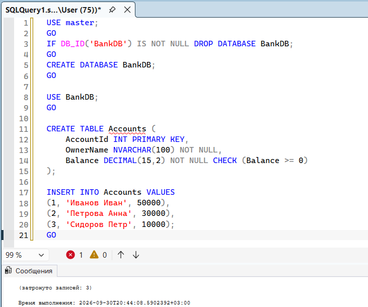

## Успешный перевод (COMMIT)

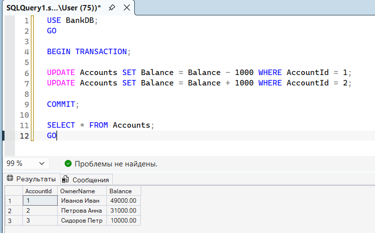

## Перевод с ошибкой (ROLLBACK)

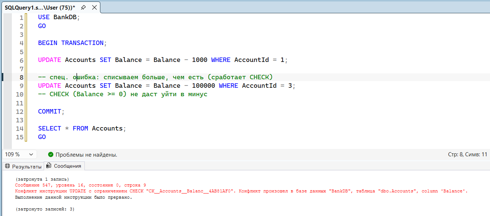

Почему откат сработал: В SQL Server при нарушении ограничения CHECK транзакция переходит в uncommittable состояние. Если ее не откатить вручную, то при попытке COMMIT она автоматически откатится, потому что одна из операций провалилась. Это гарантирует атомарность.

## Задание 2. Обработка ошибок с TRY...CATCH и XACT_ABORT

## Процедура с TRY/CATCH

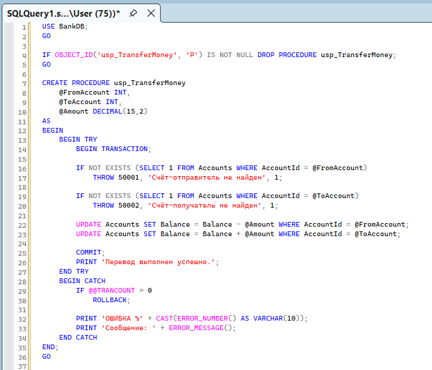

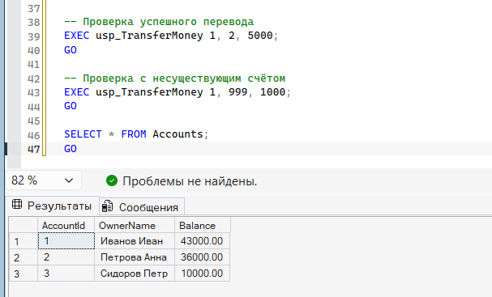

## Тест XACT_ABORT ON

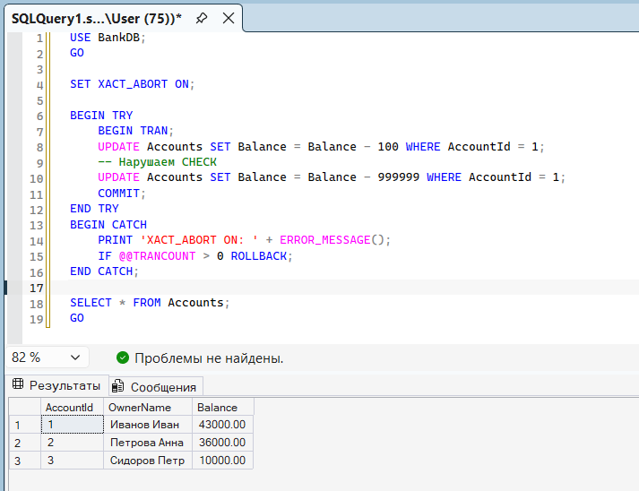

XACT_ABORT ON: При любой ошибке вся транзакция автоматически откатывается. @@TRANCOUNT обнуляется сразу.

## Тест XACT_ABORT OFF

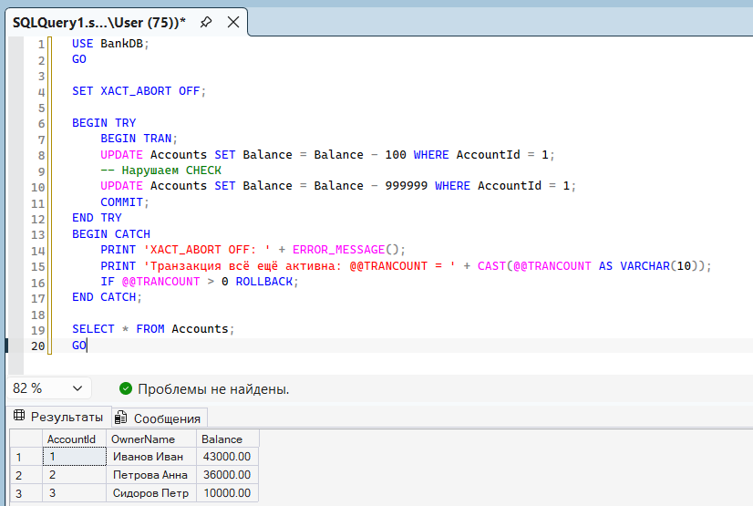

XACT_ABORT OFF: Некоторые ошибки откатывают только текущий оператор, транзакция остаётся активной. Требуется ручной ROLLBACK в CATCH

## Задание 3. Вложенные транзакции и SAVE TRANSACTION

## Создаём лог-таблицу

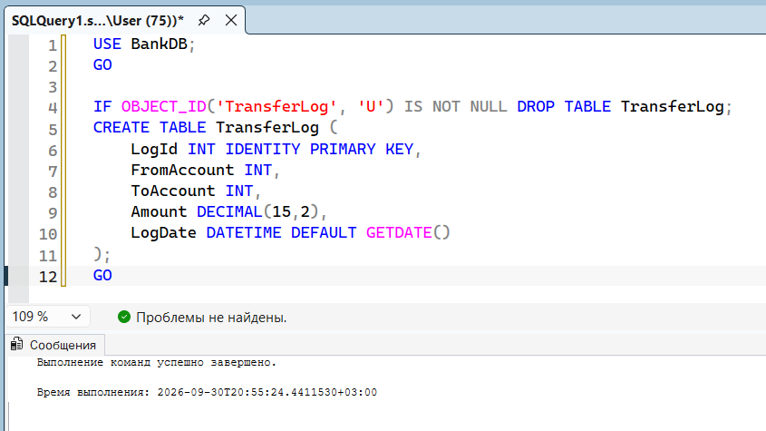

## Транзакция с SAVE TRANSACTION

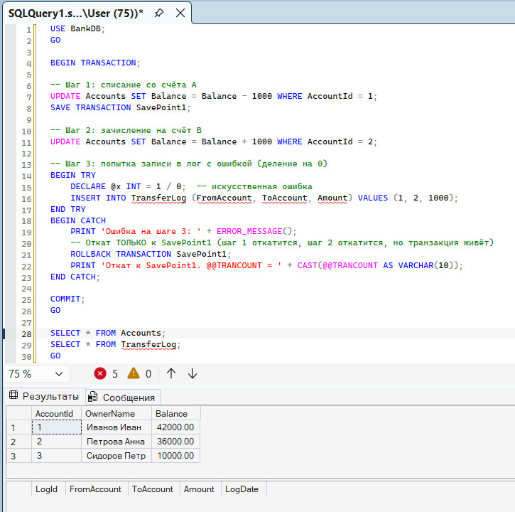

## Почему ROLLBACK TRANSACTION SavePoint1 не уменьшает @@TRANCOUNT?

@@TRANCOUNT считает количество открытых транзакций (сколько раз был вызван BEGIN TRAN минус COMMIT/ROLLBACK).ROLLBACK TRANSACTION SavePoint1 не закрывает транзакцию - он только откатывает изменения к точке сохранения. Транзакция остаётся открытой, значит @@TRANCOUNT не меняется. Уменьшить его может только COMMIT или полный ROLLBACK.

## Задание 4. Уровни изоляции и аномалии чтения

## Создаём таблицу Products

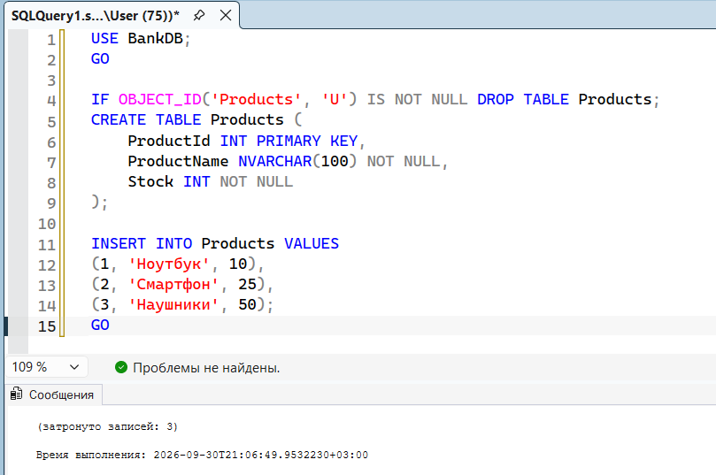

## Проверяем поведение при разных уровнях

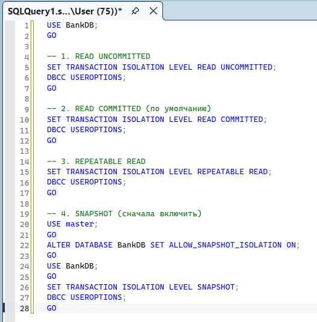

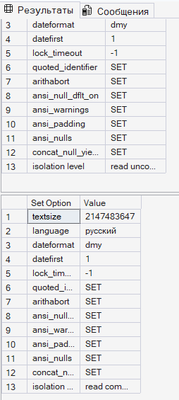

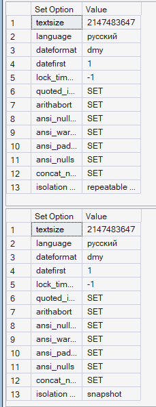

## Блокировка (короткий тест)

**Сессия 1 (окно 1):**

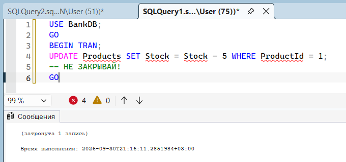

**Сессия 2 (окно 2) — проверяем блокировку:**

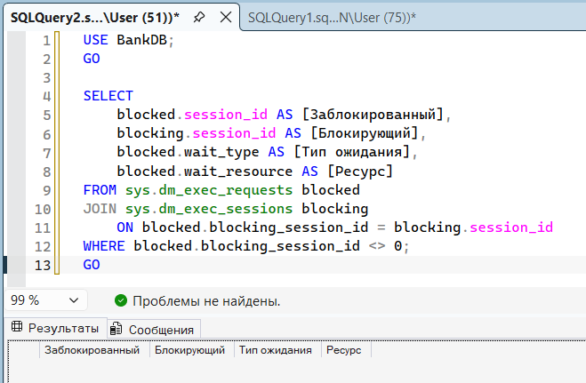

## Уровень

## Что видит читатель

## Блокировка

READ UNCOMMITTED

Грязные данные (даже незакоммиченные)

Нет

READ COMMITTED

Только закоммиченные данные

Ожидание

REPEATABLE READ

Стабильные данные

Ожидание (S-лок)

SNAPSHOT

Снимок на момент старта

Нет

Вывод для складского учёта: READ COMMITTED — оптимально. SNAPSHOT — для отчётов без блокировок.

