# Создаём базу и таблицу Products (100 000 строк, heap)

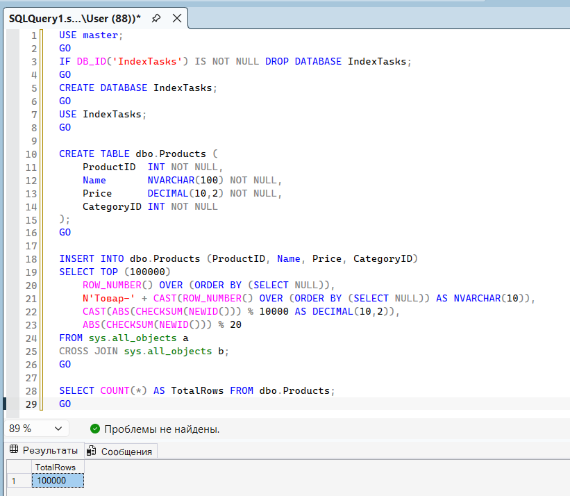

## Кластерный индекс на heap

**1.1. Замер до индекса (Table Scan):**

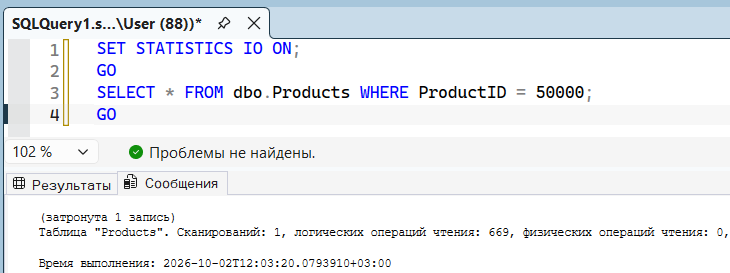

Объяснение: После создания кластерного индекса запрос выполняется через Clustered Index Seek. Logical reads = 3 (вместо 669 до индекса). Ускорение — в 223 раза.

**1.2. Создаём кластерный индекс:**

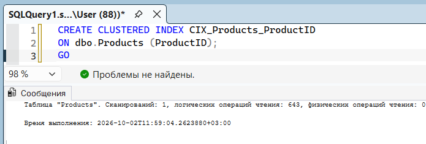

**1.3. Замер после индекса:**

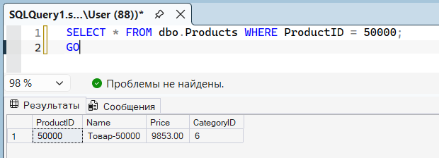

**Сообщения:**

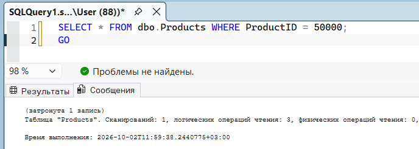

## Задача 2. Некластерный индекс + Key Lookup

## Создаём некластерный индекс на Name

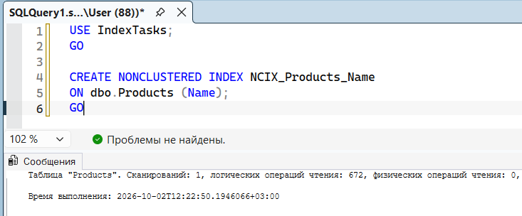

## Включаем план выполнения и выполняем запрос

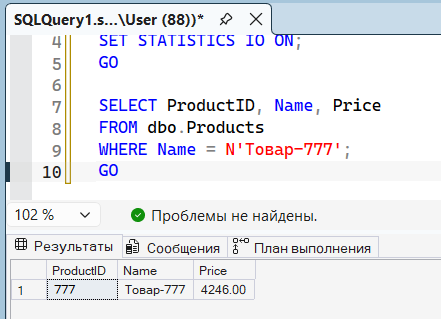

**Сообщение:**

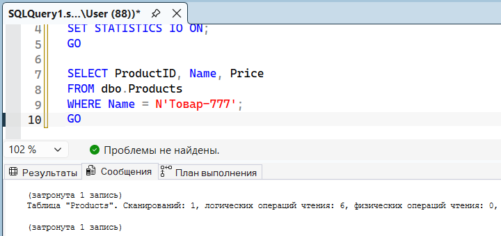

**План выполнения:**

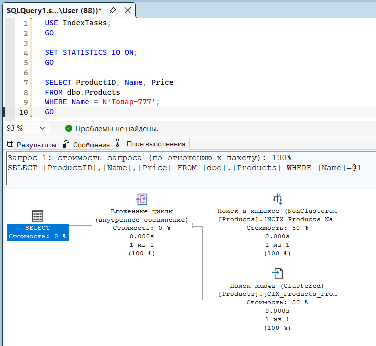

## Задача 3. Разница между Seek и Scan

## Создаём таблицу Orders (500 000 строк)

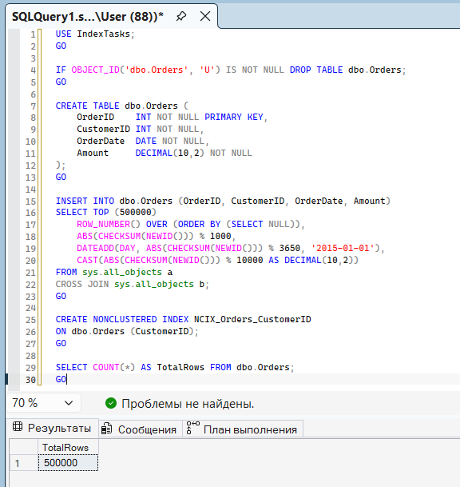

## Точечный поиск (Seek)

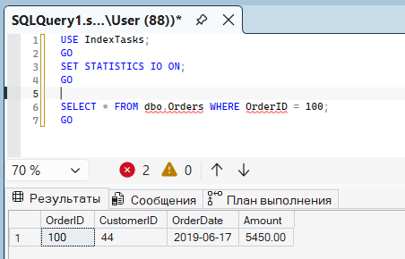

**Сообщение:**

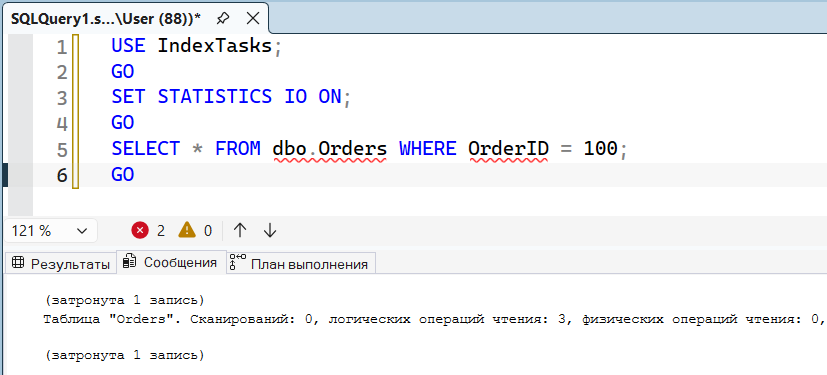

**План выполнения:**

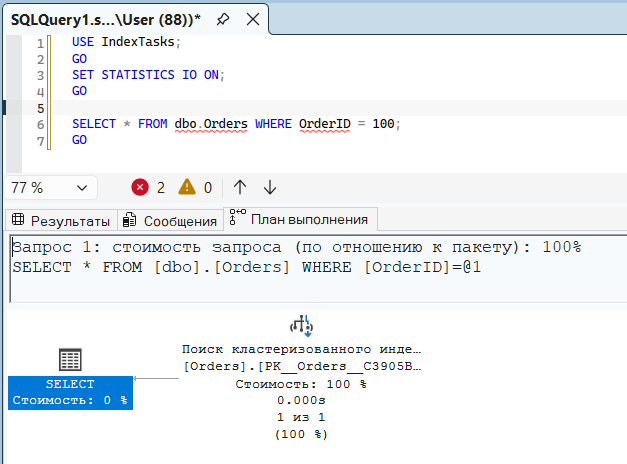

## Диапазон (Seek Range)

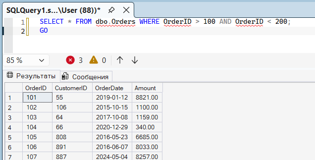

**Сообщение:**

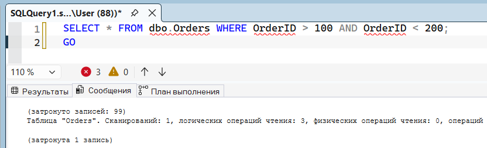

**План выполнения:**

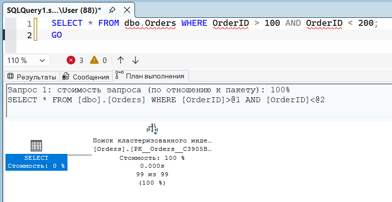

**Задача 3.3 (Scan):**

**Сообщения:**

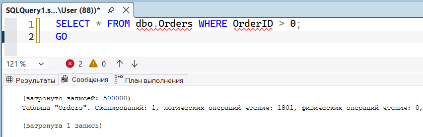

**План выполнения:**

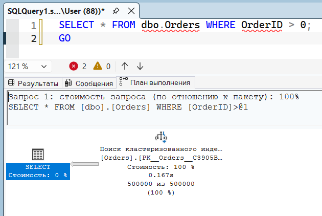

## Задача 4. Влияние селективности на выбор индекса

## Шаг 4.0. Создаём таблицу Users (200 000 строк)

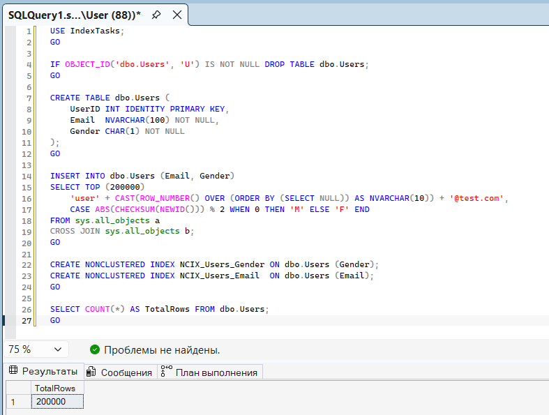

## Запрос по Gender (низкая селективность)

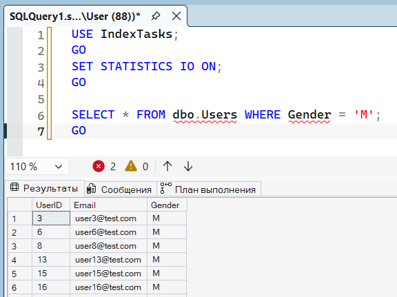

**Сообщение:**

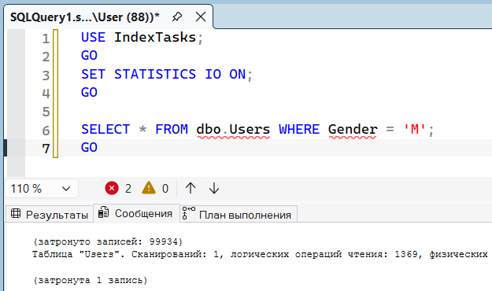

**План выполнения:**

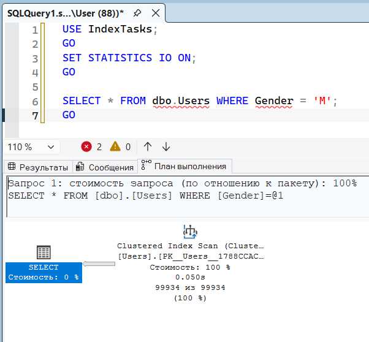

## Запрос по Email (высокая селективность)

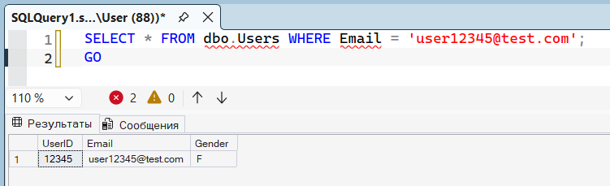

**Сообщение:**

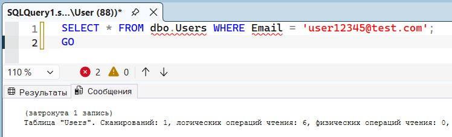

**План выполнения:**

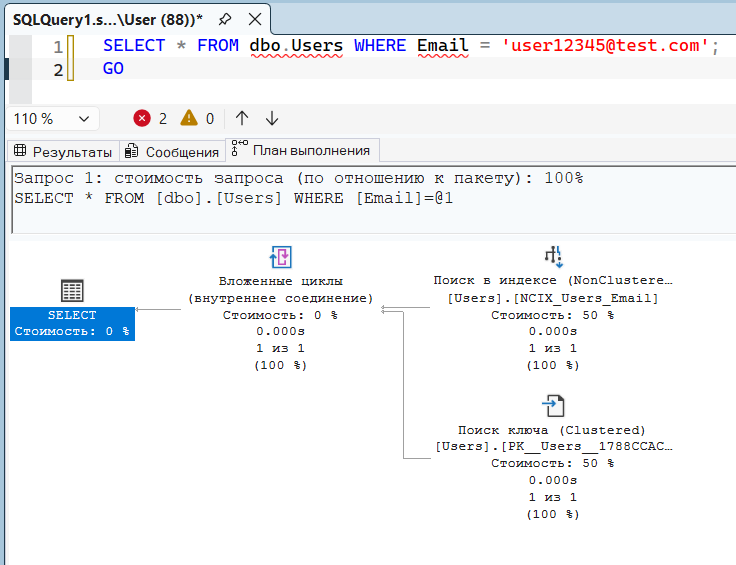

## Задача 5. Удаление и пересоздание индекса

## Шаг 5.0. Создаём таблицу Customers с индексом

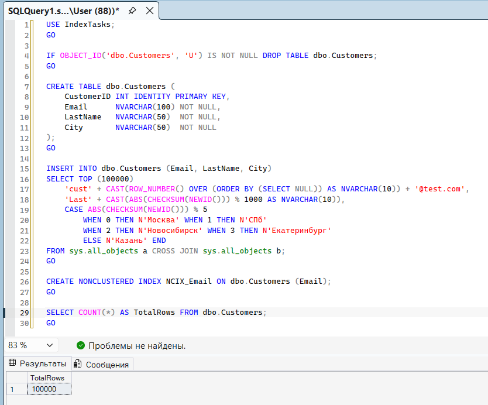

## 5.1. Размер индекса до

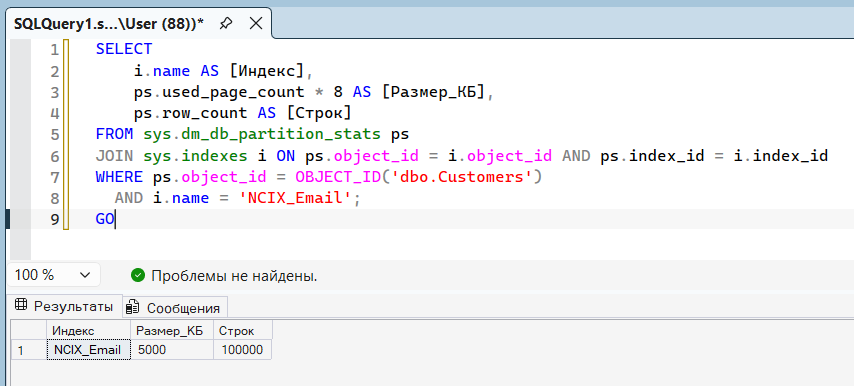

## 5.2. Удаляем индекс

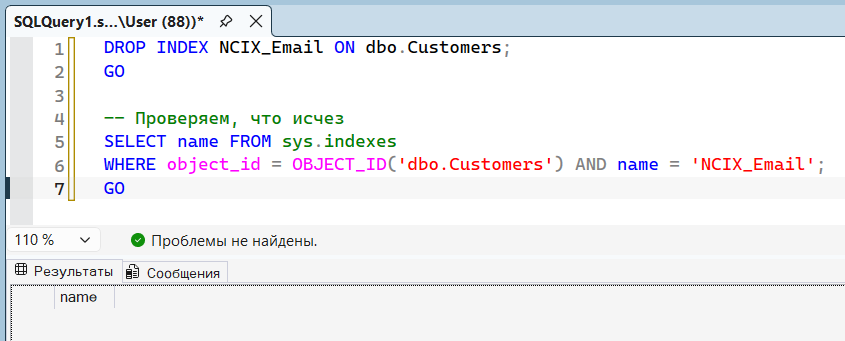

## 5.3. Пересоздаём с LastName как ключевым

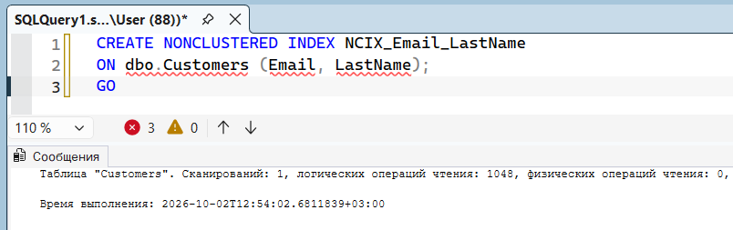

## 5.4. Размер индекса после

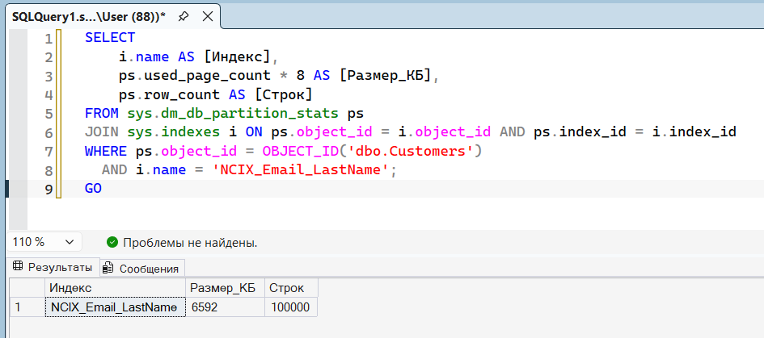

