# БД QueryStoreDemo создана, Query Store включён

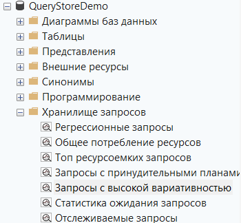

## Создал таблицу + индекс + нагрузку

## Таблица dbo.Orders создана (50000 строк)

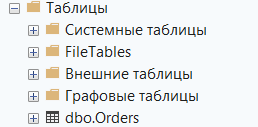

## Проверяем, что Query Store собрал данные

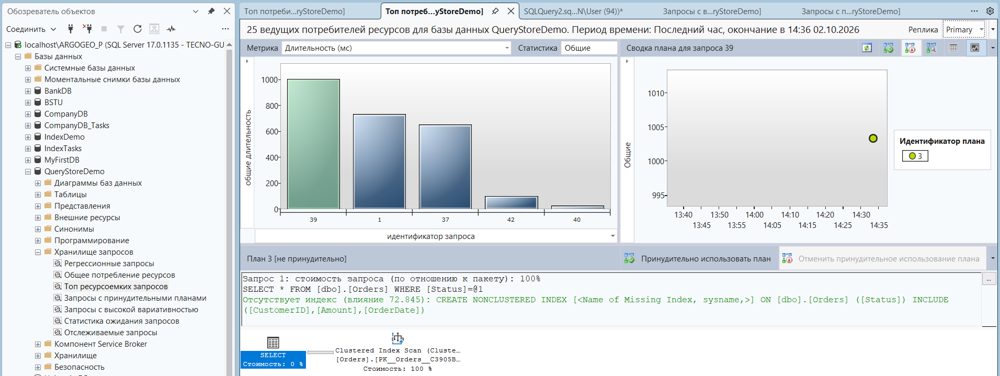

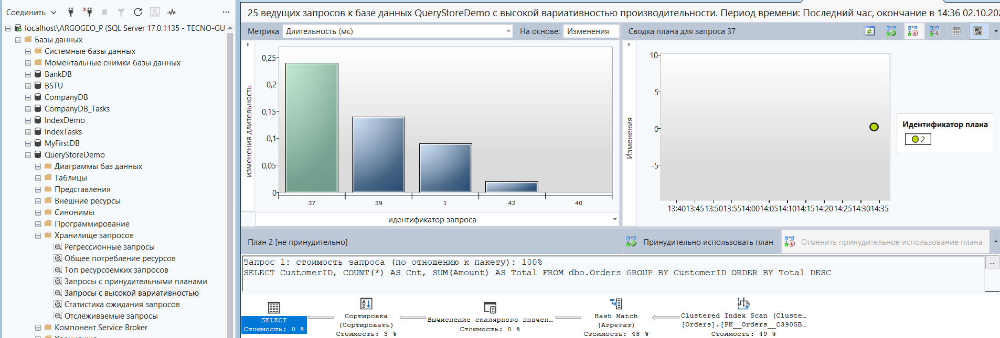

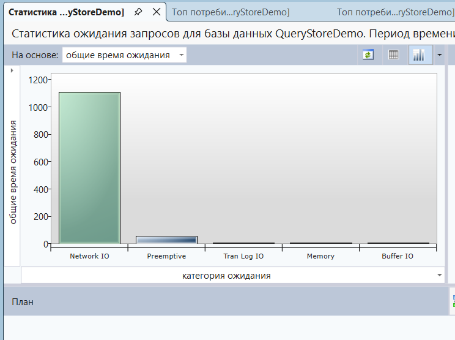

## Код 1 — ТОП-20 по CPU

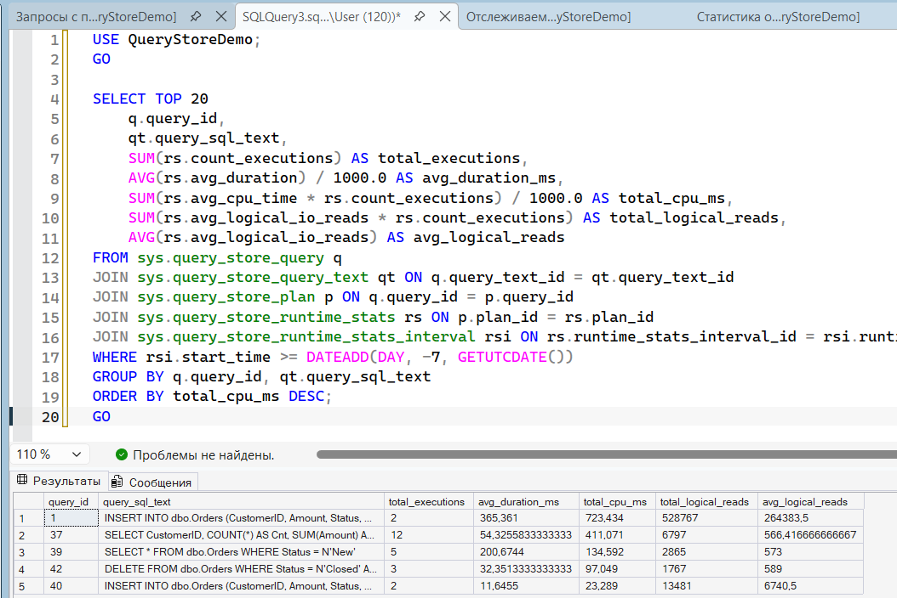

## Код 2 — Запросы с несколькими планами

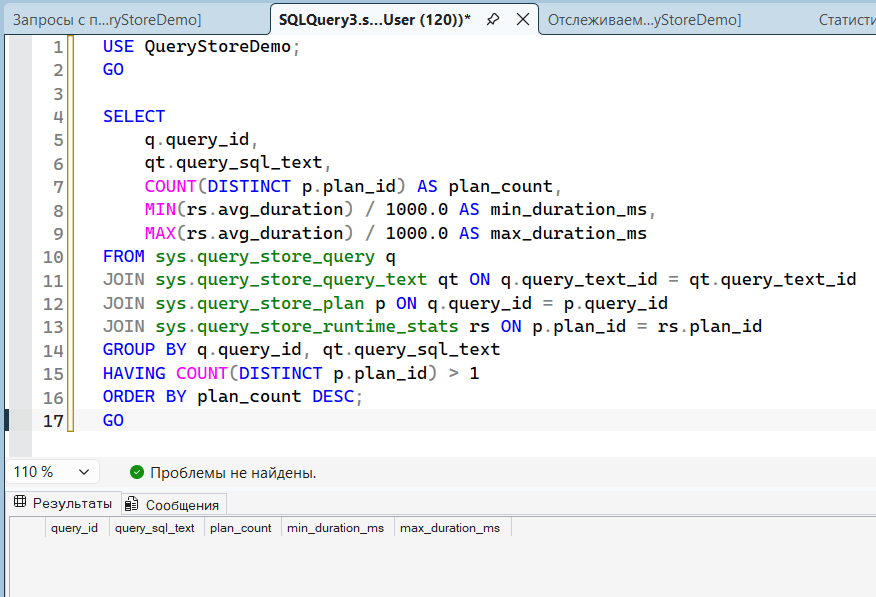

## Код 3 — История по конкретному query_id

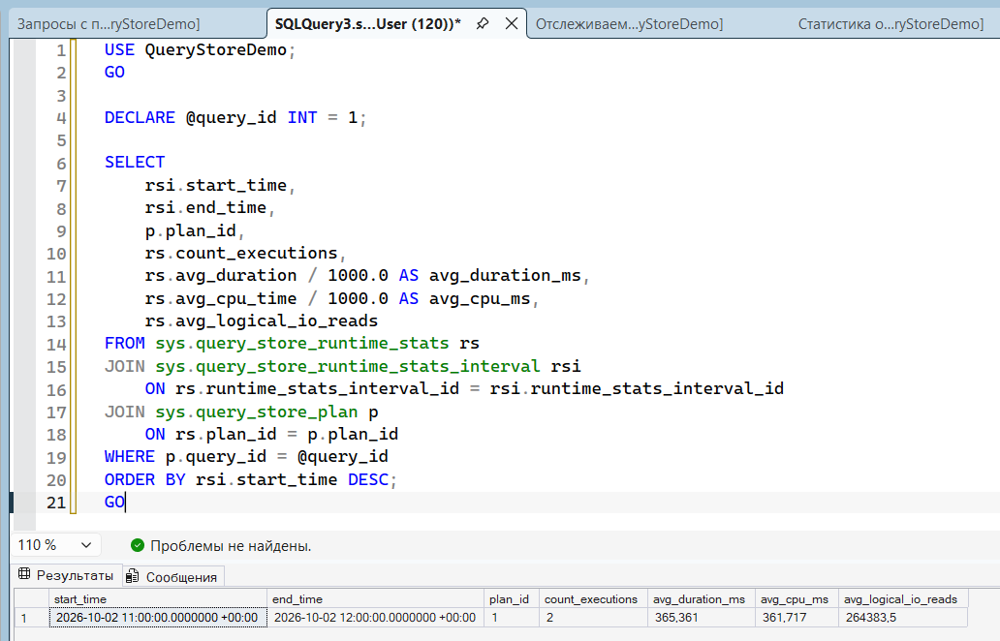

## Код 4 — Wait Stats

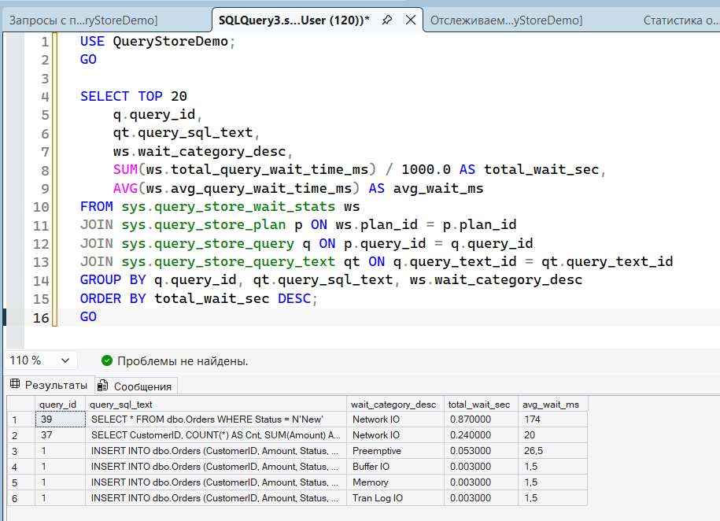

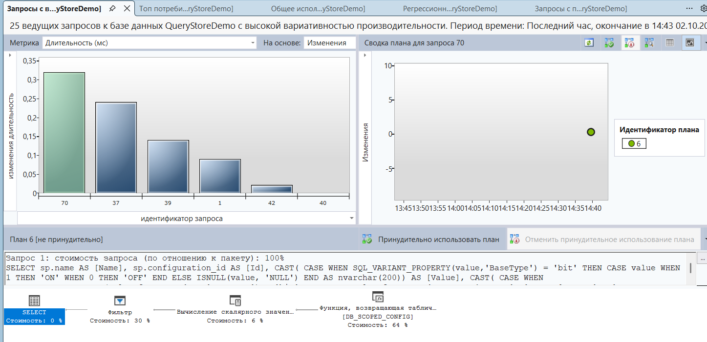

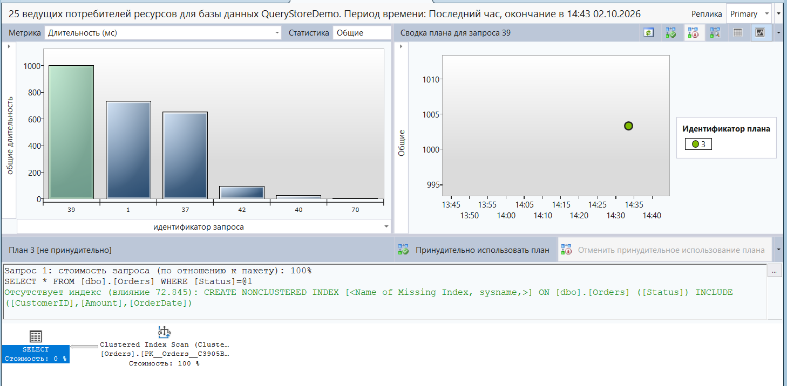

