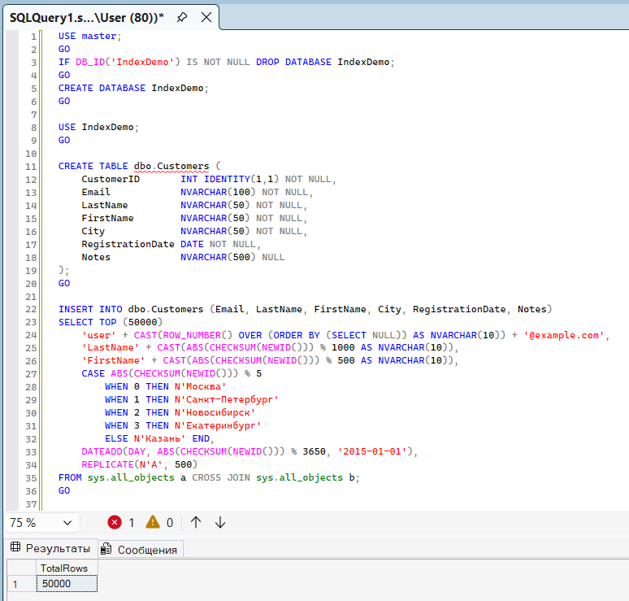
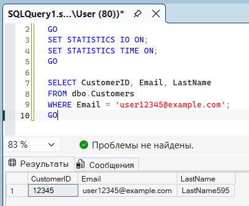
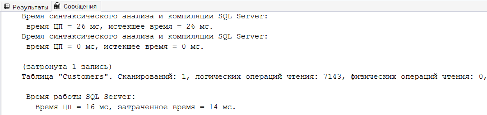
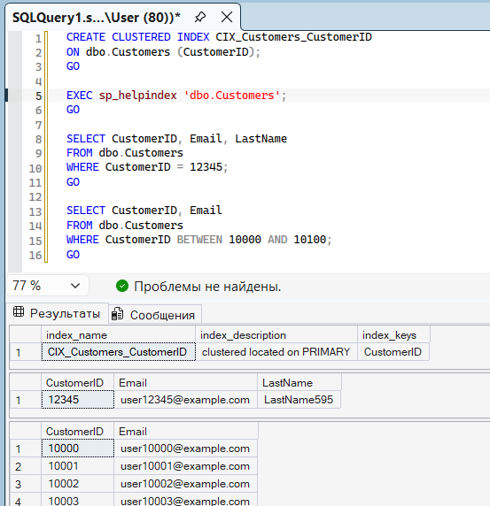
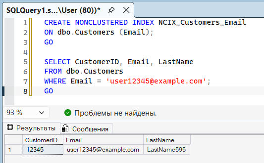
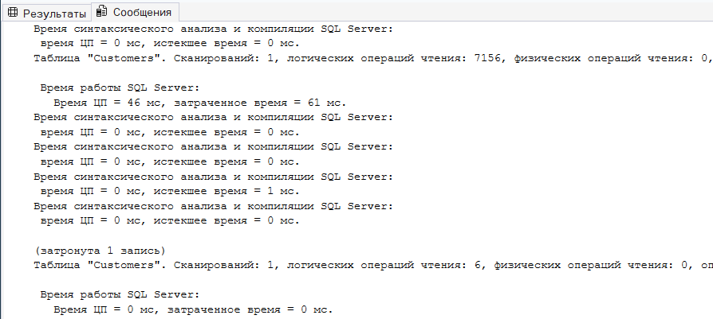
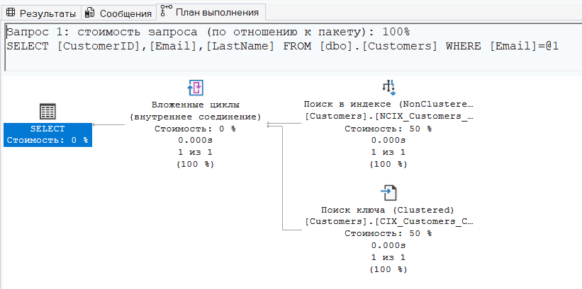
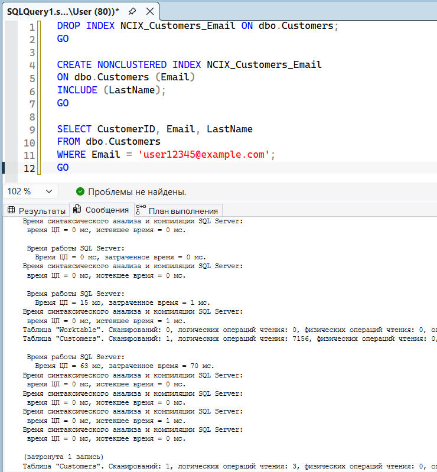
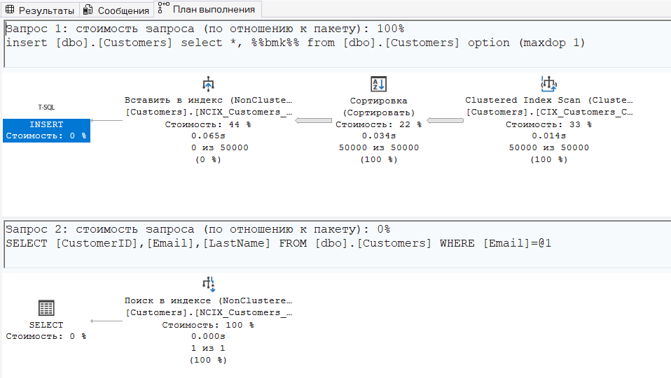

# Практика. Кластерные и некластерные индексы в MS SQL Server

## Создание БД IndexDemo + таблица Customers + 50 000 строк

## Замер до индексов (Table Scan)

**Сообщение:**

## Кластерный индекс на CustomerID

## Некластерный индекс на Email (без INCLUDE)

**Сообщение:**

**План выполнения:**

## Некластерный индекс с INCLUDE (покрывающий)

**План выполнения:**

