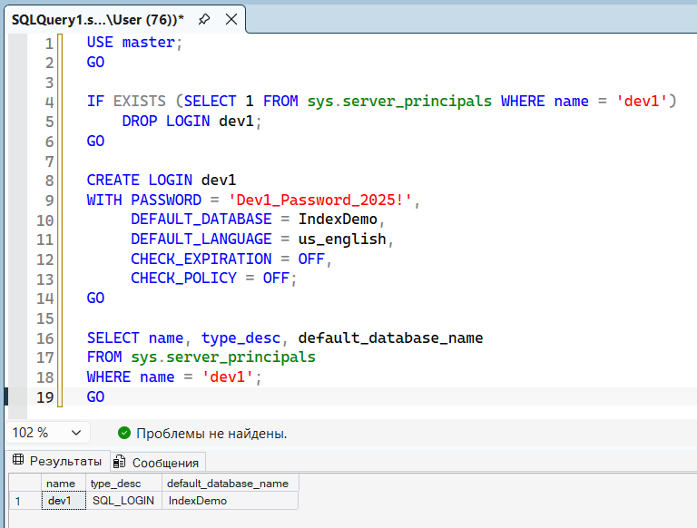
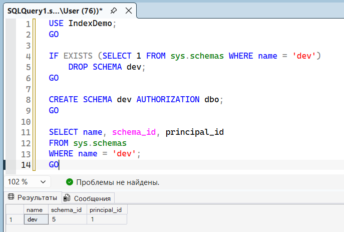
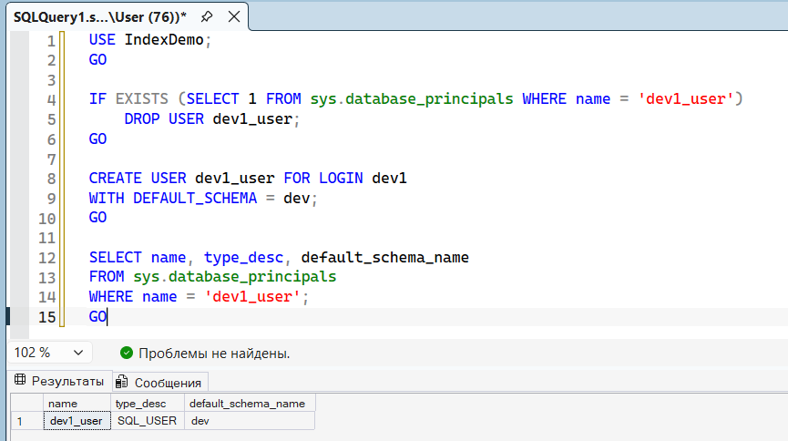
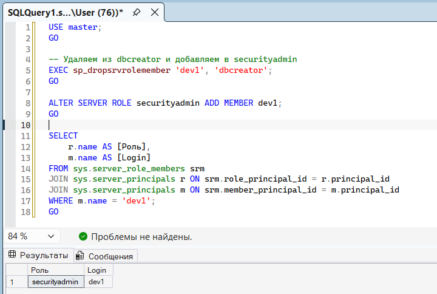
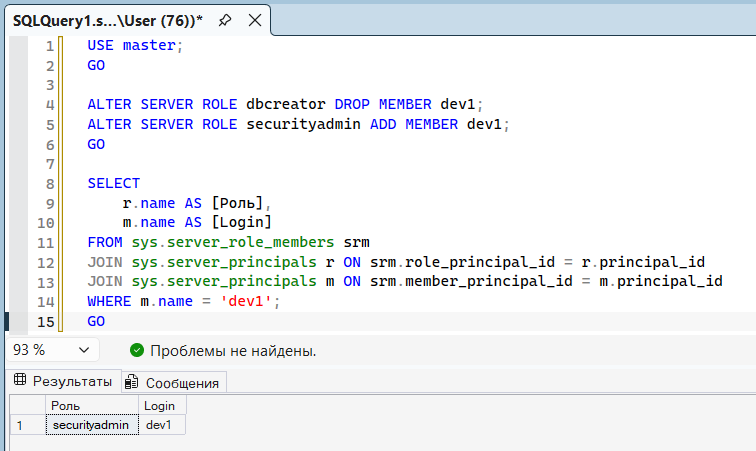
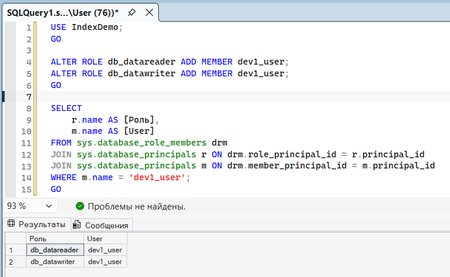
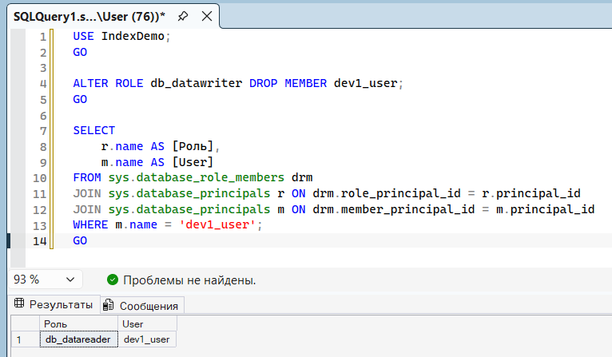
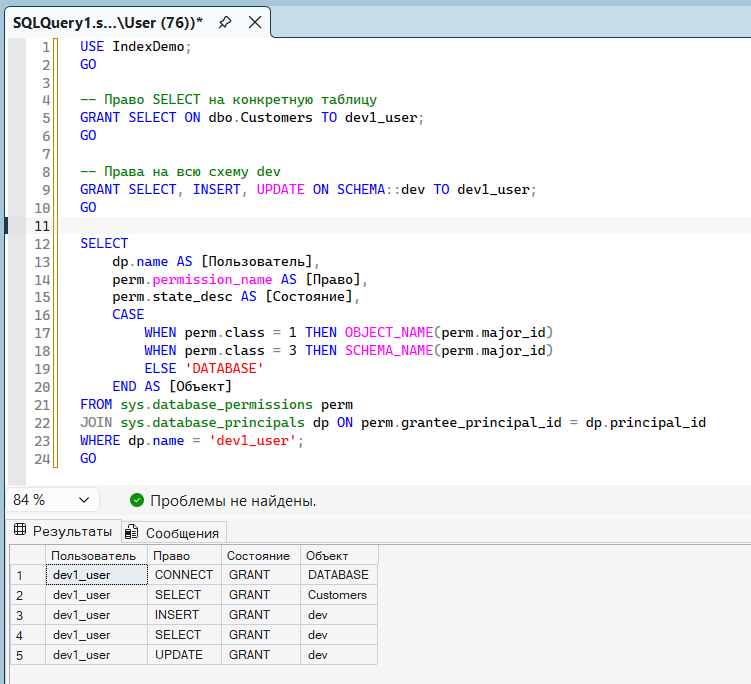

# Практика. Управление правами доступа в MS SQL Server

## Слайд 12-13. CREATE LOGIN (учетная запись SQL Server)

Что делает: Создаёт учётную запись на уровне сервера (login). Через неё пользователь проходит аутентификацию.

## Слайд 23. CREATE SCHEMA

Что делает: Создаёт схему - логическую группу объектов (таблиц, представлений, процедур). Схема упрощает выдачу прав сразу на группу объектов.

## Слайд 27. CREATE USER

Что делает: Создаёт пользователя базы данных (user) и привязывает его к login. Без этой привязки login не имеет доступа к БД.

## Слайд 35. ALTER SERVER ROLE ADD

Что делает: Добавляет или удаляет login из серверной роли (sysadmin, dbcreator, securityadmin и др.). Серверные роли дают права на уровне всего сервера.

## Слайд 35 (2). ALTER SERVER ROLE DROP

Что делает: Удаляет login из серверной роли.

## Слайд 40. ALTER ROLE ADD MEMBER

Что делает: Добавляет пользователя БД в роль базы данных (db_datareader, db_datawriter, db_owner и др.). Роли БД дают права на объекты внутри одной БД.

## Слайд 40 (2). ALTER ROLE DROP MEMBER

Что делает: Удаляет пользователя из роли БД.

## Слайд 55. GRANT

Что делает: Выдаёт разрешение на объект (таблицу, схему, процедуру). Можно выдавать на уровне БД, схемы или конкретного объекта.

