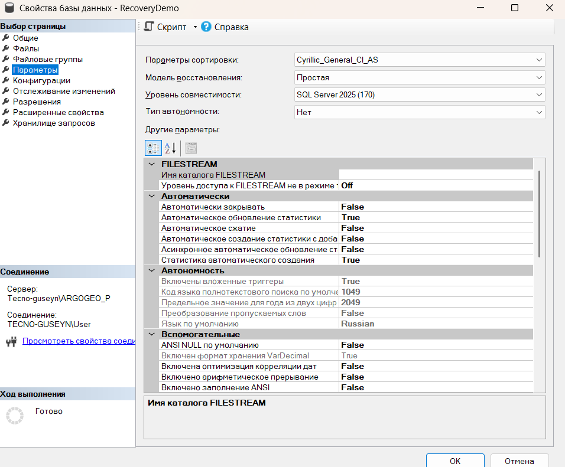
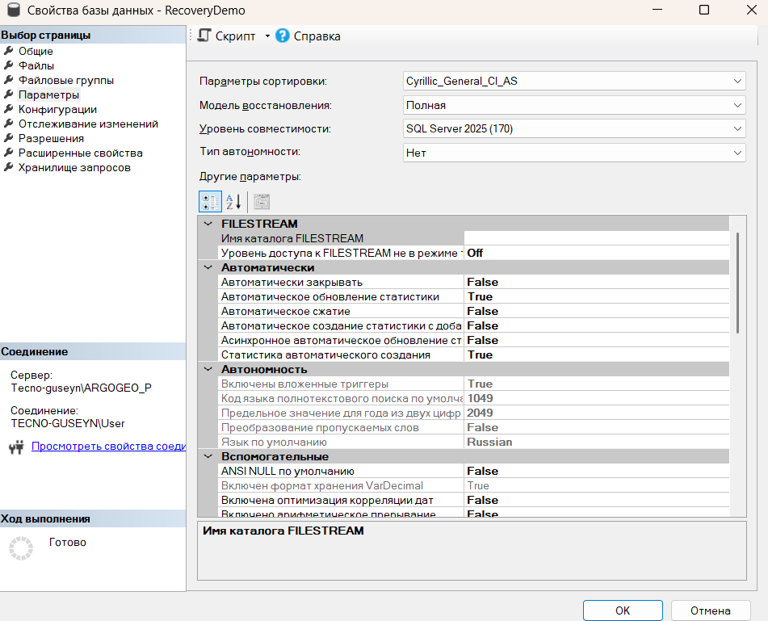
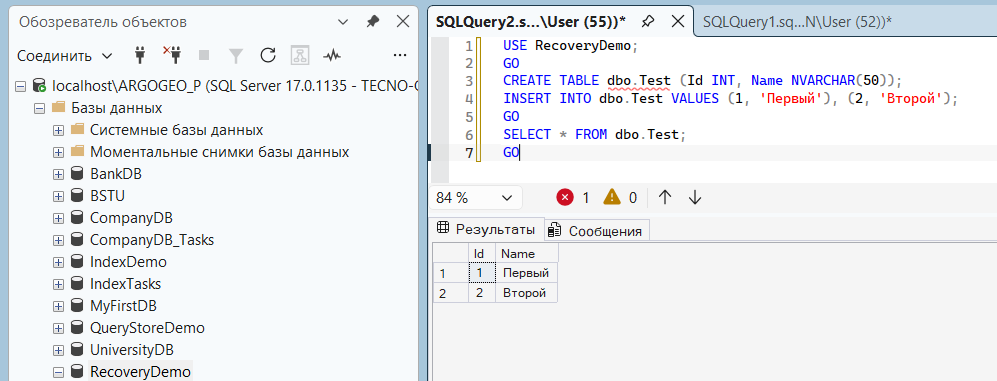
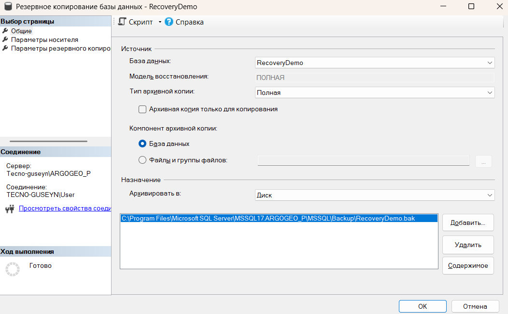
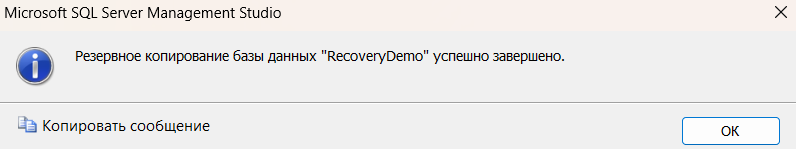
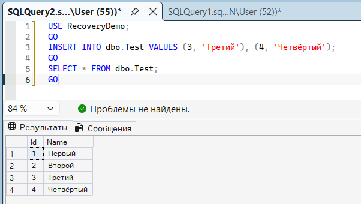
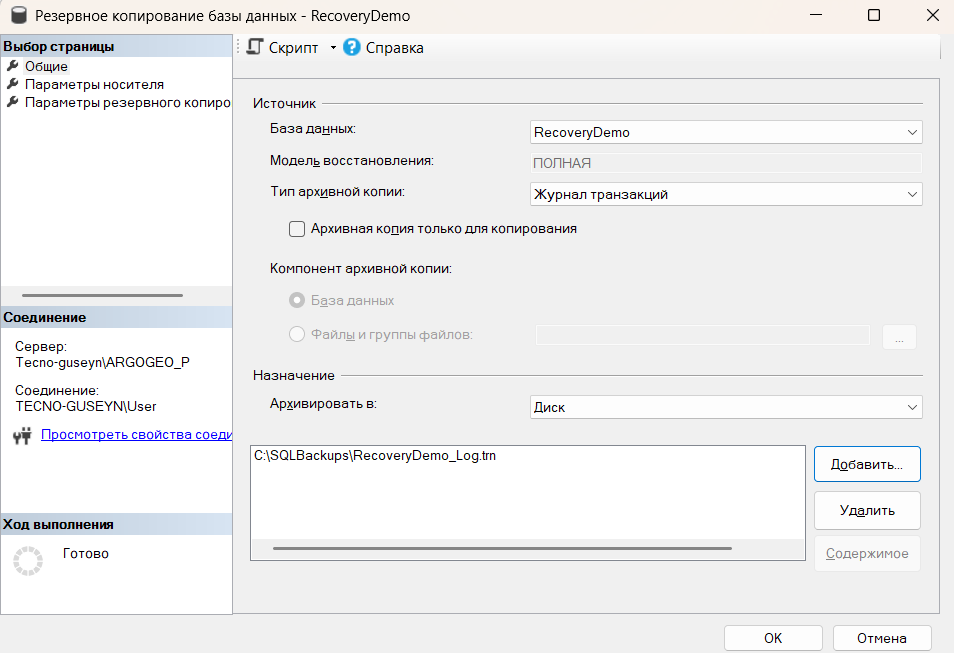
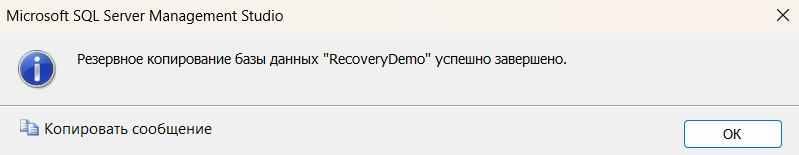
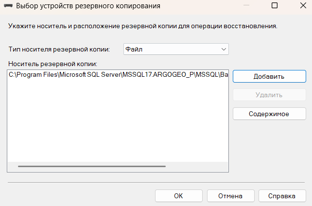
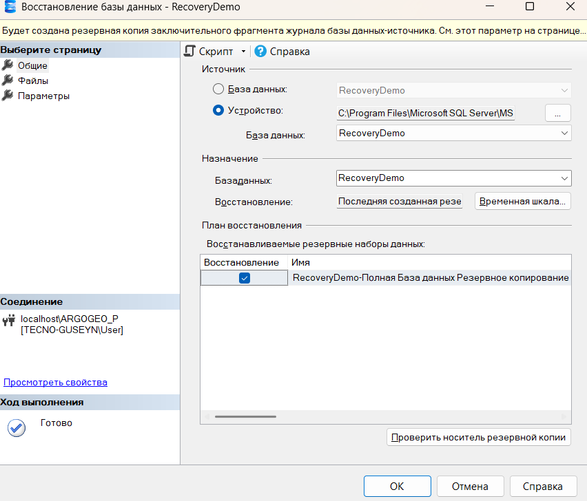

# Демонстрация смены моделей

до

после

## Создаём таблицу и данные

## Создание полной резервной копии

## Добавляем новые данные (чтобы потом было что терять)

## Создание резервной копии журнала транзакций

## RESTORE — восстановление

