# Практика. Управление правами доступа и ролями в MS SQL Server

## Задание 1. SQL-логин с политикой паролей

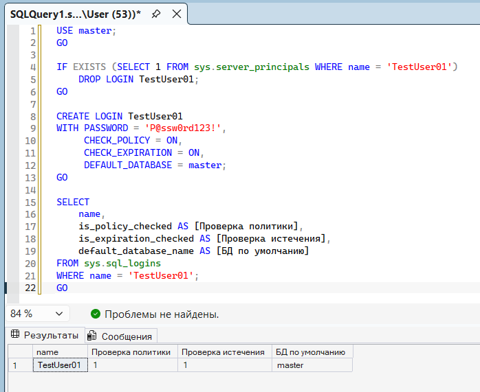

## Подключение под TestUser01 + второй узел в Object Explorer

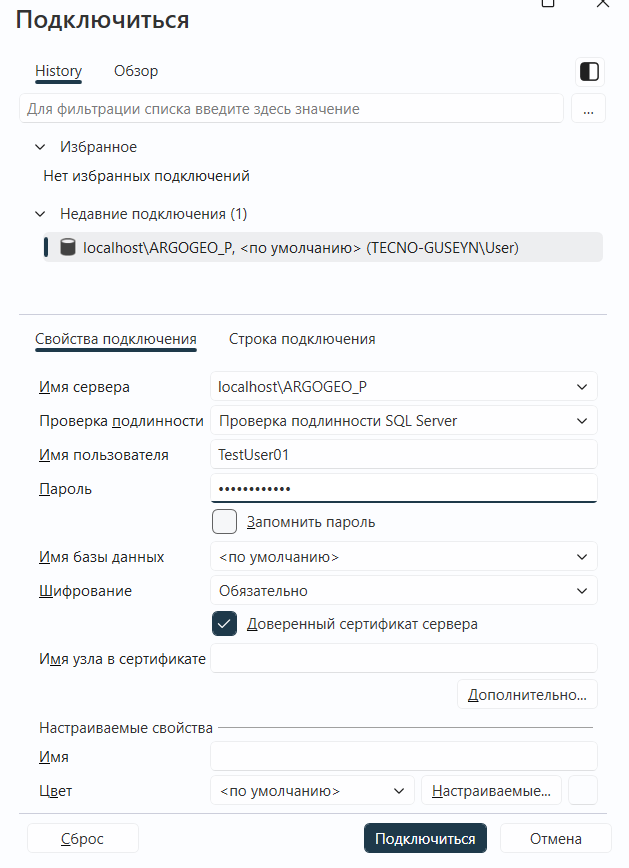

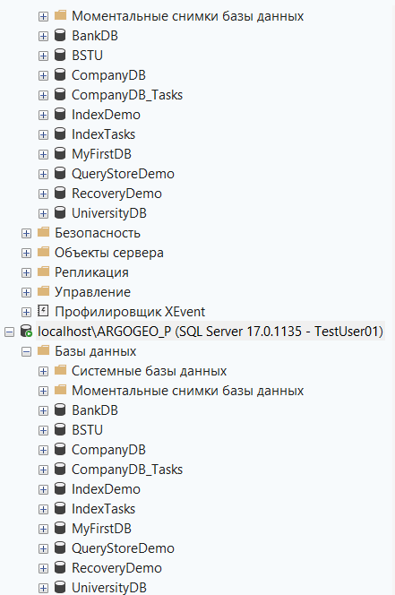

## Проверка: SUSER_NAME() = TestUser01, DB_NAME() = master

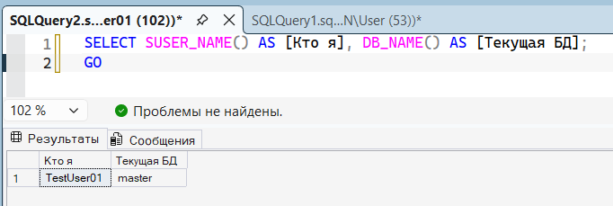

## Задание 3. Пользователь без логина

## Создаём тестовую БД TestDB

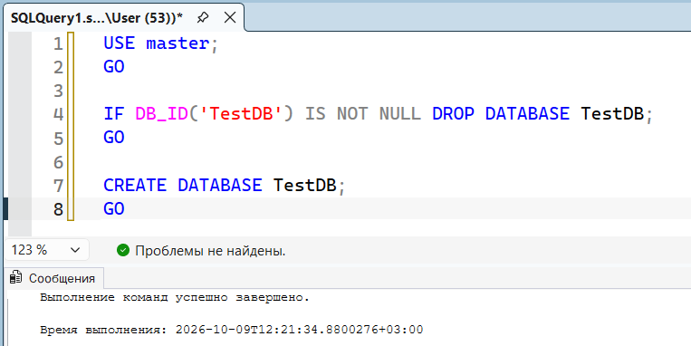

## Создаём пользователя WITHOUT LOGIN

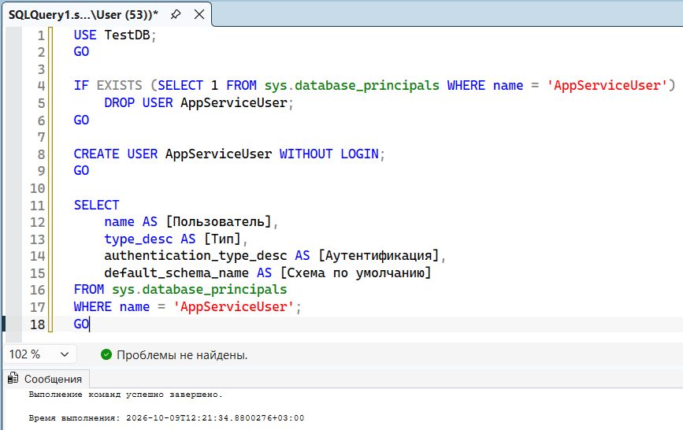

## Даём права пользователю

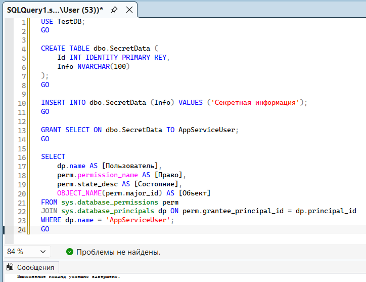

**Пересоздаём БД TestDB, так как произошла ошибка при демонастрации (Сообщение 15517, уровень 16, состояние 1, строка 5 Невозможно выполнить в качестве участника базы данных, поскольку участник "AppServiceUser" не существует, этот тип участника не может проходить олицетворение, или отсутствует разрешение. (затронута 1 запись) Сообщение 208, уровень 16, состояние 1, строка 11)**

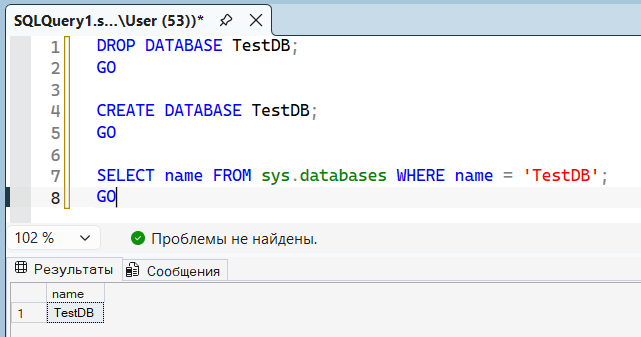

## Создаём пользователя без логина

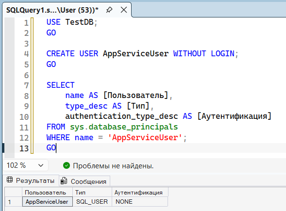

## Создаём таблицу и даём права

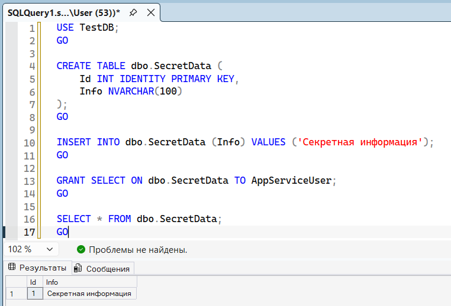

## Даём право IMPERSONATE

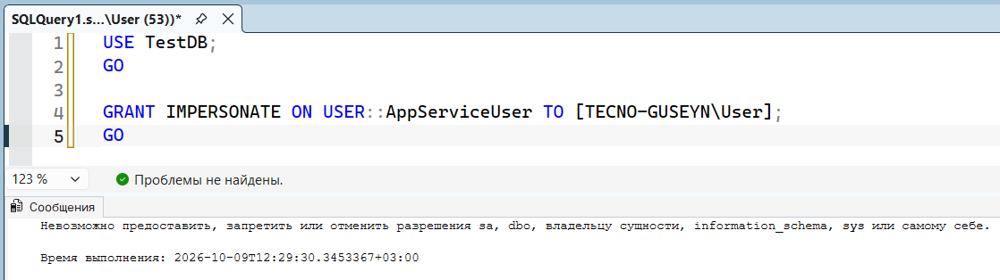

## Демонстрация EXECUTE AS

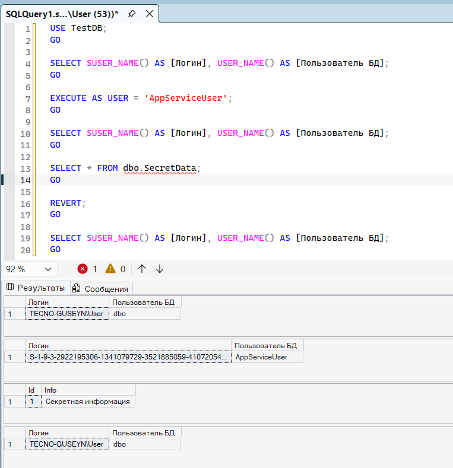

## Задание 4. Логин с истёкшим сроком действия пароля

## Создаём логин TempUser с CHECK_EXPIRATION = ON

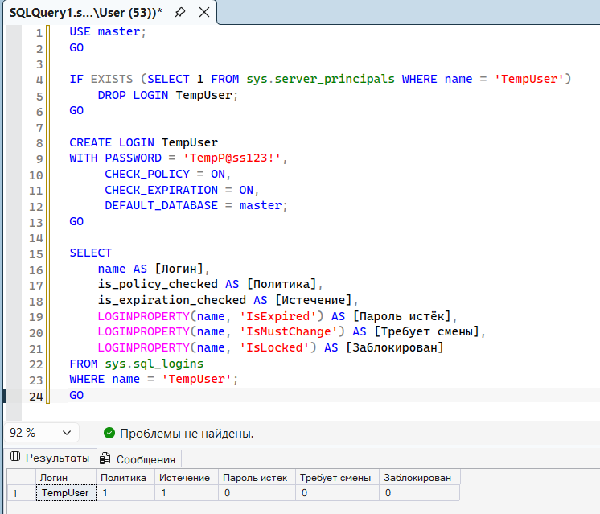

## Симулируем истёкший пароль

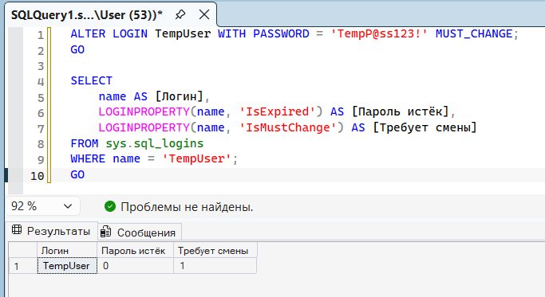

## Попытка подключиться под TempUser

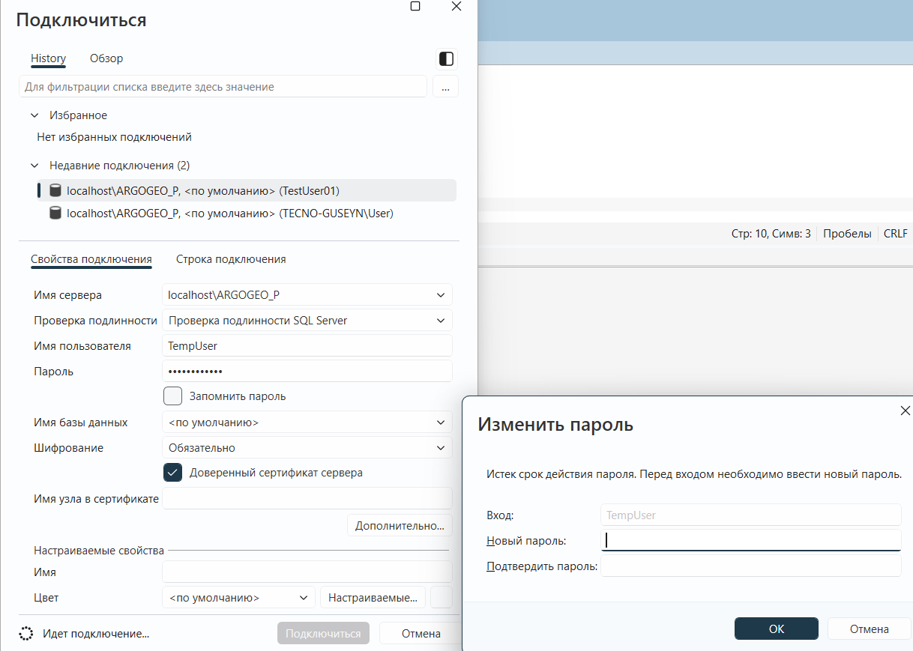

## Задание 5. Список всех логинов и пользователей

## Все SQL-логины на сервере

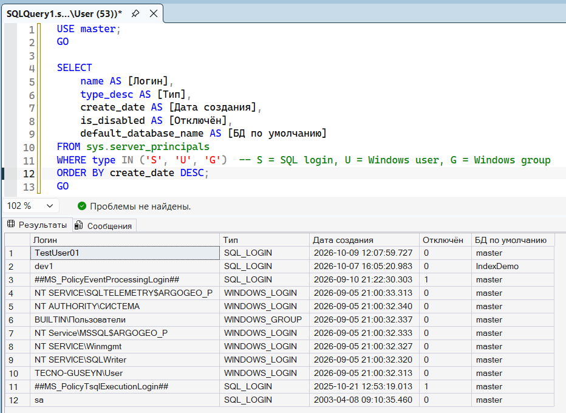

## Все пользователи в текущей базе

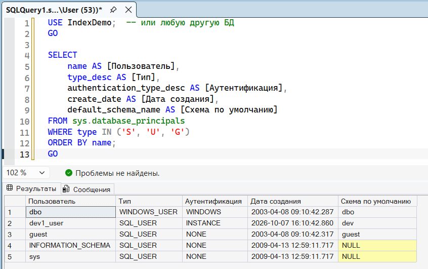

## Задание 6. Добавление логина в серверную роль

## Добавляем TestUser01 в securityadmin

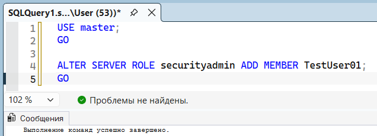

## Проверяем членство

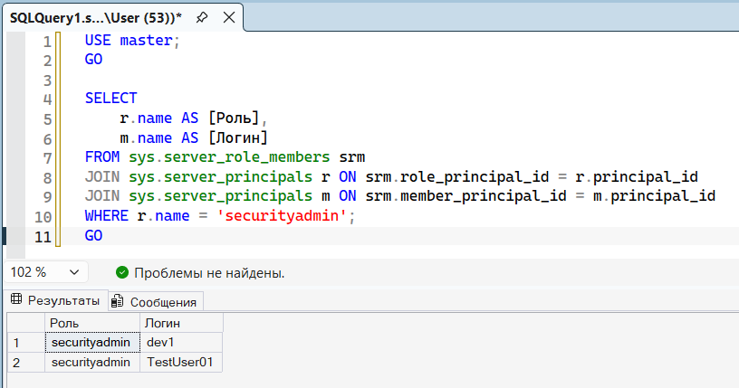

## Все роли TestUser01

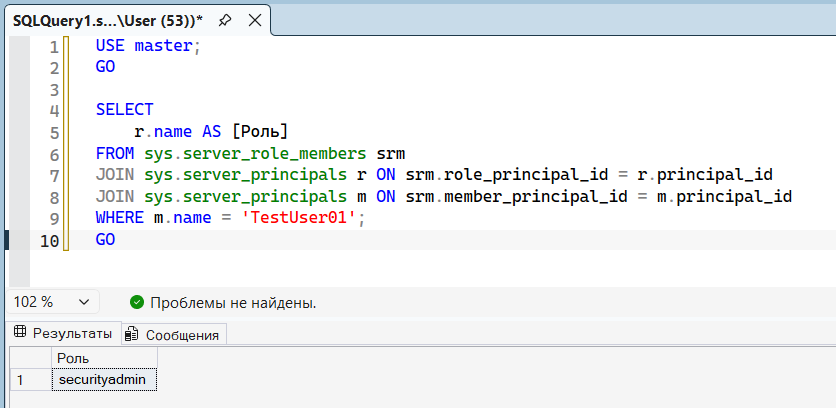

## Задание 8 + 9. Роли логина + удаление из роли/роли

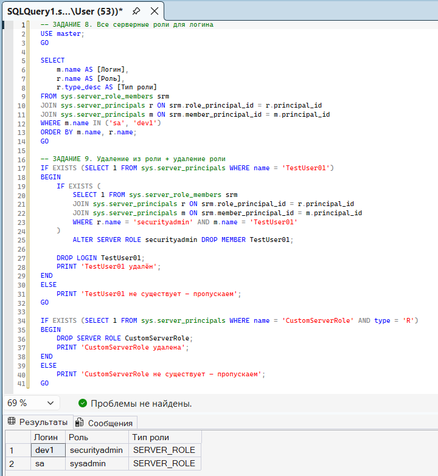

## Роли БД и точечные права (Задания 10 + 11 + 12)

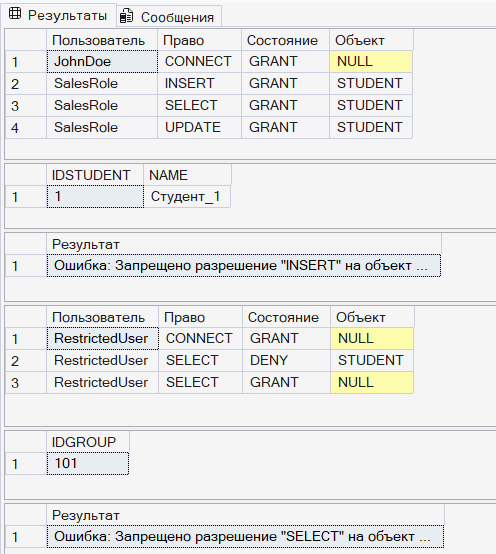

## Задание 13. Права на процедуры

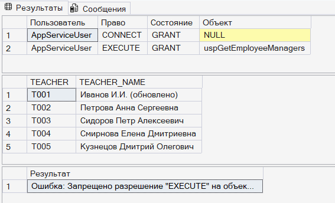

## Задание 14. Эффективные права

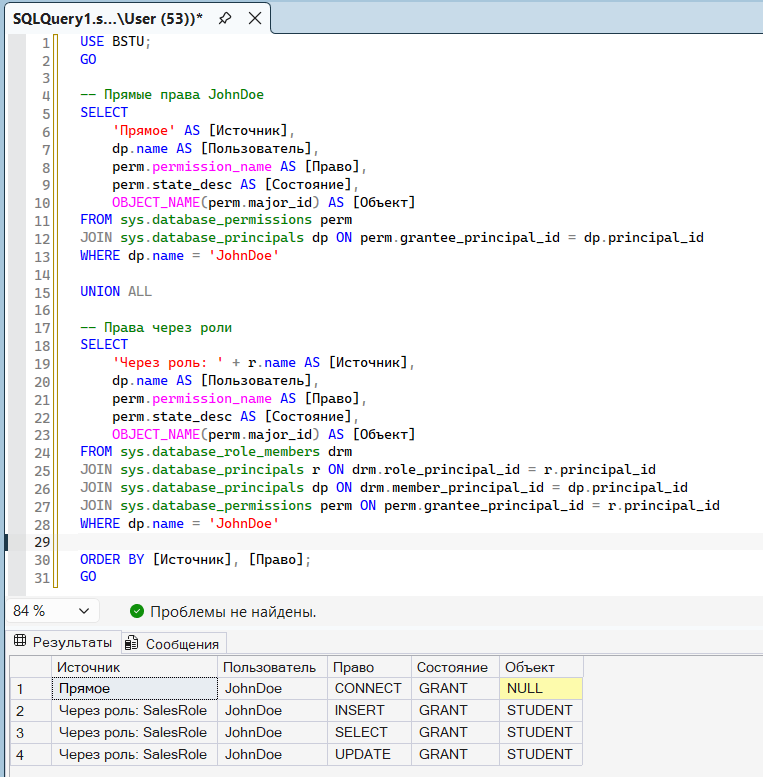

## Задания 15-16. Серверный аудит + входы

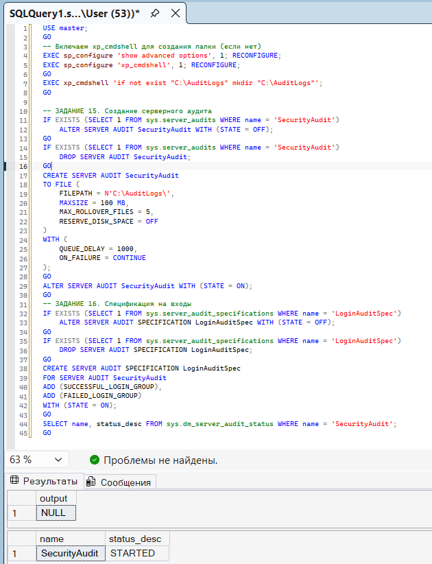

